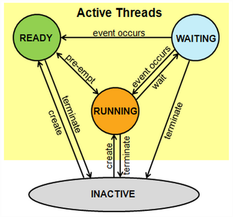
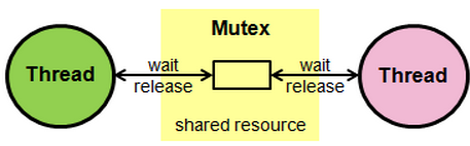
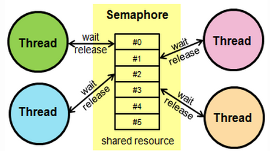

Rapid Embedded Systems - Design and Programming Course - Rev 1.1

[Table of Contents](/README.md#syllabus)

---


---

# Module 10 - Real-time operating systems

## Lecture slides

The lecture slides relevant to this section are listed below.

| Lecture | Description |
| - | - |
| 10 | [ Real-time operating systems](./Module_10.pptx) |
| |

If you clone this repository, lecture slides are available in PowerPoint format in the folder `Materials/Module_10`

#  1 Operating systems


## What is an operating system ?

An operating system (OS) is a middleware between the developer and concrete hardware, such as processor, board, peripherals, etc.  A developer should be able to realize code for similar hardware environments in a identical way

Operating system (OS)
:

* An intermediary interface between user applications and computer hardware
* Facilitates application development (convenience and efficiency)
* Various OSs are available in the market for various hardware platforms, e.g., Windows, Linux, Unix, Mac OS, Android, iOS.

<figure>

<figcaption> Figure 1: Operating system overview</figcaption>
</figure>

## Functions of an operating system

An operating system acts as an interface between the high-level user application and the low-level hardware components, and it is usually capable of:

* Managing the processor
* Managing memory
* Managing devices
* Manging file systems
* System security
* Fault tolerance and error detection
* Multitasking and job accounting
* Task coordination

In order to manage the functions, different basic services have to be provided, including:

* Scheduling tasks
* Allocating memory resources
* Manging IOs
* Managing file systems
* Communicating and networking
* Detecting and fixing errors
* Protecting and securing information

## Types of operating systems

### Number of users

The most challenging tasks for an OS are ensuring fair load (and time) distribution among different applications and processes and keeping data consistent via memory management. The greater the number of independent applications that need to run, the more challenging the task.


Single-user OS

Single user, single processor, which is not suitable for OS anymore, because it only provides manual low-level programming
* Only one user can access it
* May allow multiple programs to run at the same time, standard for desktop operating systems

Multi-user OS

Multi-user, many (time shifted) processes, in which all users can apply for a task on a system.  In reality, users put their tasks into a queue (= batch) and all items are processed sequentially (= batch processing).


* Allows multiple users to access it at the same time
* Multi-user, many (simultaneous) processes, which accommodates real multitasking, multi-processing, and parallel computing systems.


### Technical aspects

Distributed OS accommodates specialized operating tasks on multiple CPUs
* Processing is distributed across multiple CPUs
* Processors are interconnected via communication lines, such as internal high-speed buses or various types of networks

Embedded OS , which needs a very small footprint and is used specifically to manage interrupt controlled hardware interaction
* Designed to be used in embedded computer systems
* Limited resources such as memory, IOs, clock speed
* Compact and energy efficient

Real-Time OS which guarantees task- and process-handling within defined time intervals (= real-time)
* Multitasking OS targeted at real-time applications, with real-time constraints
* Must quickly and predictably respond to events

# 2 Real-Time Operating System 

A Real-time OS (RTOS) is an OS that:

* Serve real-time applications
* Responds to requests within a guaranteed and predictable delay
* Processes data in deterministic cycles

RTOS aims at deterministic performance foremost, rather than high throughput
* Performance can be measured by jitter: the variability of the time it takes to complete a task
* Soft RTOS: more jitter, but usually or generally meets a deadline
* Hard RTOS: less jitter, can meet a deadline deterministically 

<b>Real-time (definition)</b> <br>
Real-time guarantees the completion of a process within a defined time interval.
Real-time does not make any statement about the total time duration or the processing speed.


<i><b>Summary</i></b>

An RTOS’s process completion time is completely deterministic and guarantees a defined time interval, without reference to a particular processing speed. Real-time does not necessarily mean fast.  A very fast process can be blocked and stuck, which means that it is no longer real-time.

For example, imagine that a transatlantic ocean liner must have one emergency-radio-contact every 24 hours. If no contact is registered, a search-and-rescue procedure will be initiated. This includes all the elements of a RTOS: a defined time interval, an action and a result, and a backup-procedure in case of a failure.  Note that 24 hours is not fast, but it is defined!


## RTOS Design Philosophies

An RTOS is based on two main design strategies: load and priority dependent, or independent.  These two strategies are also called pre-emptive and non-pre-emptive.


<B>Event-driven RTOS</B><br>
A pre-emptive system allocates more processing time to a higher priority task. Lower priority tasks may be stopped until a higher priority task finishes. If the lower priority task is real-time, a very detailed plan is performed in advance, in order to provide sufficient time intervals for all potentially active tasks.
* Pre-emptive task scheduling
* An event of higher priority needs to be served first
* Processes data more responsively

<B>Time-sharing RTOS</B><br>
Non-pre-emptive schedule is much more predictive.  All processes are started and stopped within defined time slices, regardless of whether they need the full time slice.  This may be very inefficient for a system with a low load because it is constantly scheduling and switching tasks.

A more intelligent algorithm for time sharing could be the ‘round-robin’-method, which considers both priorities and the remaining loads of single processes.

* Non-pre-emptive task scheduling
* Tasks are switched on a regular clocked interrupt, and on events, e.g., round robin scheduling
* Tasks are switched more often, giving a smoother multitasking
* However, unnecessary task switching results in undesired overheads

## RTOS Task Scheduling

In a typical RTOS, a task can have at least three states:
* Running: task is currently executed by the CPU
* Ready: task is ready to be executed by the CPU
* Blocked: task is paused and waiting for an event, such as from I/O, to resume its execution

<B>Task scheduling</B><br> 
Usually, only one task per CPU can run at any one time.
To efficiently switch between tasks, usually a task scheduler is used.<br> Various scheduling algorithms exist, including:
* Cooperative scheduling: no pre-emption, tasks can end themselves in a cooperative manner
* Pre-emptive scheduling:  tasks can be interrupted by other tasks of higher priorities
* ‘Earliest deadline first’ approach:  the task with the earliest deadline is served first

Examples of RTOS include LynxOS, OSE, Windows CE, FreeRTOS, Arm Keil RTX, etc.


# 3 ARM Keil RTX RTOS

## Highlights of Arm Keil RTX RTOS

The Keil RTX RTOS is an RTOS based on Arm Cortex-M systems.  Its functionality is also implemented in the mbed platform.  This slide lists some of its special features.


* Deterministic RTOS designed for Arm Cortex-M-based devices
* Multitasking with flexible scheduling: round-robin, pre-emptive, and collaborative
* High-speed real-time operation with low interrupt latency
* Small footprint for resource-constrained systems
* Royalty-free, deterministic RTOS with source code
* Unlimited number of tasks each with 254 priority levels
* Support for multithreading and thread-safe operation
* Inter-task communication manages the sharing of data, memory, and hardware resources among multiple tasks
* Unlimited number of mailboxes, semaphores, mutex, and timers (hardware-permitting)
* Defined stack usage - each task is allocated a defined stack space, enabling predictable memory usage


## mbed RTOS
The mbed system provides an API for the Keil RTX RTOS kernel, based on CMSIS RTOS. As mentioned in previous modules, CMSIS is the foundation for hardware abstraction between different Arm processor types.

<b>Mbed RTOS API</b>
* Provides easy-to-use API for programming mbed-enabled devices
* Based on Keil RTX RTOS kernel implementation
* Uses the CMSIS-RTOS API open standard

<b>CMSIS-RTOS API</b>
* Common API for real-time operating systems
* Foundation of the official Mbed RTOS
* Provides a standardized programming interface that is portable to many RTOSs
* Hence enables software templates, middleware, libraries, and other components that can work across various supported RTOS systems

Next, we will explain three concepts relating to core elements of shared memory real-time programming:
* Threads
* Mutexes
* Semaphores


## Threads

<b>A task can sometimes be referred to as a thread in multitasking systems</b>


<figure>

<figcaption> Figure 2: Thread States</figcaption>
</figure>


A Thread in mbed API can be in the following states:

* <b>Running</b> - The thread that is currently running is in the Running state. Only one thread at a time can be in this state.

* <b>Ready</b> -  Threads that are ready to run are in the Ready state. Once the Running thread has terminated or is Waiting, the next Ready thread with the highest priority becomes the Running thread.

* <b>Waiting</b> - Threads that are waiting for an event to occur are in the Waiting state.

* <b>Inactive</b    > Threads that are not created or terminated are in the Inactive state. These threads typically consume no system resources.

| Function name	| Description |
| - | - |
| `Thread (osPriority priority=osPriorityNormal, uint32_t stack_size=OS_STACK_SIZE, unsigned char *stack_mem=nullptr, const char *name=nullptr)` | Allocate a new thread without starting execution.|
| `osStatus 	start (mbed::Callback< void()> task)` |Starts a thread executing the specified function. |
| `osStatus terminate ()` | 	Terminate execution of a thread and remove it from Active Threads. |
| `osStatus set_priority (osPriority priority)`	| Set priority of an active thread.|
| `osPriority get_priority () const` | 	Get priority of an active thread. |
| `uint32_t 	flags_set (uint32_t flags)`	| Set the specified Thread Flags for the thread.|
| `State 	get_state () const` | State of this Thread.  |
| For the full API visit the <a href="https://os.mbed.com/docs/mbed-os/v6.15/apis/thread.html">mbed os documentation for Threads </a> |

*Figure 3: Member functions of the Thread API*


### Blinky using threads

```C++
/*
 * Copyright (c) 2020 Arm Limited and affiliates.
 * SPDX-License-Identifier: Apache-2.0
 */
#include "mbed.h"

DigitalOut led1(LED1);
DigitalOut led2(LED2);

Thread thread;

void led2_thread()
{
    while (true) {
        led2 = !led2;
        ThisThread::sleep_for(1000ms);//Puts the thread into the WAITING state for 1000 ms
    }
}

int main()
{
    thread.start(led2_thread); // Starts the second thread

    while (true) {
        led1 = !led1;
        ThisThread::sleep_for(500ms); //Puts the thread into the WAITING state for 500 ms
    }
}
```

| Threads |
| --- |
| How many threads are in the application? **<p title="Two threads. The main thread and the newly created thread">Hover here to see the solution</p>** |
| What does the <b><i>ThisThread::sleep_for(500ms)</b></i> line do? **<p title="ThisThread::sleep:for(500ms) puts the thread in the WAITING state for 500ms">Hover here to see the solution</p>** |


## Mutex

<b>Mutual Exclusion Object</b><br>
Ensures no two threads are in their critical section accessing a shared resource at the same time

In RTOS, the mutex is used to: 
* Synchronize the execution of threads
* Protect access to a shared resource, such as a shared memory image

<figure>

<figcaption> Figure 4: Mutex</figcaption>
</figure>

| Function name	| Description |
| - | - |
| `Mutex ()` | Create and Initialize a Mutex object.|
| `void 	lock ()` | Wait until a Mutex becomes available.  |
| `bool 	trylock ()` | Try to lock the mutex, and return immediately.  |
| `bool 	trylock_for (uint32_t millisec)` | 	Try to lock the mutex for a specified time|
| `void 	unlock ()`	| Unlock the mutex that has previously been locked by the same thread.|
| For the full API visit the <a href="https://os.mbed.com/docs/mbed-os/v6.15/apis/mutex.html">mbed os documentation for Mutex </a> |

*Figure 5: Member functions of the Mutex API*

### Using a Mutex

```C++
/*
 * Copyright (c) 2020 Arm Limited and affiliates.
 * SPDX-License-Identifier: Apache-2.0
 */
#include "mbed.h"

Mutex stdio_mutex;
Thread t2;
Thread t3;

void notify(const char *name, int state)
{
    stdio_mutex.lock(); // lock standard output if it not locked already 
    printf("%s: %d\n\r", name, state); // current thread is the owner, print to console
    stdio_mutex.unlock(); // unlock 
}

void test_thread(void const *args)
{
    while (true) {
        notify((const char *)args, 0); 
        ThisThread::sleep_for(1000ms);
        notify((const char *)args, 1);
        ThisThread::sleep_for(1000ms);
    }
}

int main()
{
    t2.start(callback(test_thread, (void *)"Th 2"));
    t3.start(callback(test_thread, (void *)"Th 3"));

    test_thread((void *)"Th 1");
}
```

In this example, a mutex object is generated for the stdio, to allocate and release the stdio for printing. 
The function calling the printing stdio blocks it for 2000ms.

In the main routine, two and one main procedure are started (see pink frame), generating this output:

> Th2: 0
<br>
> -> 1 second: Th3: 0
<br>
> -> 1 second: Th1: 0
<br>
> -> 1 second: Th1: 1
<br>
> -> 1 second: Th3: 1
<br>
> -> 1 second: Th2: 1

If mutex were not blocking stdio, the output could have been arbitrarily mixed.


## Semaphores

A semaphore is a variable of abstract data type used to manage and protect access to shared resources. Unlike a mutex, it does not have the concept of an owner.
* Unlike a mutex, a semaphore can control access to several shared resources
* For example, a semaphore enables access to and management of a group of identical peripherals

<figure>

<figcaption> Figure 6: Semaphores</figcaption>
</figure>

| Function name	| Description |
| - | - |
| `	Semaphore (int32_t count=0)` | Create and Initialize a Semaphore object used for managing resources.|
| `void 	acquire ()` | Wait until a Semaphore resource becomes available. |
| `bool 	try_acquire ()` | Try to acquire a Semaphore resource, and return immediately. |
| `bool 	trylock_for (uint32_t millisec)` | 	Try to lock the mutex for a specified time|
| `osStatus 	release (void)`	| Release a Semaphore resource that was obtain with Semaphore::acquire|
| For the full API visit the <a href="https://os.mbed.com/docs/mbed-os/v6.15/apis/semaphore.html">mbed os documentation for Semaphores </a> |

*Figure 5: Member functions of the Semaphore API*

## Using Semaphores

```C++
/*
 * Copyright (c) 2020 Arm Limited and affiliates.
 * SPDX-License-Identifier: Apache-2.0
 */
#include "mbed.h"

Semaphore one_slot(1);
Thread t2;
Thread t3;

void test_thread(void const *name)
{
    while (true) {
        one_slot.acquire(); //Blocks if no resources are available
        printf("%s\n\r", (const char *)name); //Print thread name when resources available
        ThisThread::sleep_for(1000ms); 
        one_slot.release(); // Releases semaphore, increment semaphore ( resource count )
    }
}

int main(void)
{

    t2.start(callback(test_thread, (void *)"Th 2"));
    t3.start(callback(test_thread, (void *)"Th 3"));

    test_thread((void *)"Th 1");
}
```


In this example, the stdio is released for 2 threads. If both slots are not used, the second thread uses it immediately; otherwise, it waits until the first slot is released again.  Let’s look at the output:

Result we would like to see:
> Th 2 
<br>
> -> immediately: Th 3
<br>
> -> 1 second: Th 1

Result we might see:

> Th Th 3
<br>
> 2
<br>
> ->1 second: Th 1

This is because both threads will try to use the stdio simultaneously.
