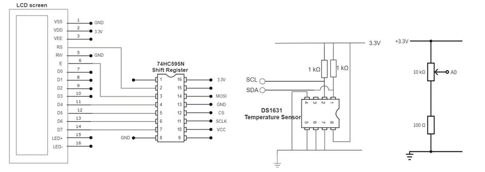

Rapid Embedded Systems - Design and Programming Course - Rev 1.1

[Table of Contents](/README.md#syllabus)

---


---

# Lab 6 - Real-time operating systems

## Lecture slides

The lecture slides relevant to this section are listed below. It is suggested you follow these first before attempting the lab materials.

| Lecture | Description |
| - | - |
| 10 | [ Real-time operating systems](./Module_10.pptx) |
| |

If you clone this repository, lecture slides are available in PowerPoint format in the folder `Materials/Module_10`


# 1 Introduction 

In this lab, you will integrate the functions developed in the previous modules and run them concurrently in the Mbed RTOS. Each of the previous tasks will be executed in one thread that is scheduled by the RTOS. There are four threads:
* Displaying the temperature on the LCD
* Adjusting the brightness of the RGB LED using a potentiometer
* Displaying an incrementing counter on the LCD
* Blinking an LED


# 2 Requirements

In this lab, we will be using the following hardware and software: 
* Mbed Studio, an IDE designed to streamline development and prototyping using Mbed enabled microcontrollers and development boards

OR

* Mbed online compiler, which can be found here: https://ide.mbed.com/compiler

* NUCLEO-F401RE, or another suitable Mbed OS 5 compatible development board. A full list of compatible devices can be found here: https://os.mbed.com/platforms, note that outputs may have to be reconfigured for devices following a different standard.

* A breadboard, 2 x 100Ω resistor, 2 x 1kΩ resistor, 1 x 10kΩ potentiometer, 1 x temperature sensor (DS1631), 1 x LCD (NHD_0216HZ), 1 x shift register (74HC595N), 3 x RGB LED and 1 x LED.

The code skeleton, which includes some assistance for implementing the task in 4.2, should be found [here](./Lab6_resources/Hardware/code/RTOS/main.cpp), with the accompanying [manual](./Lab6_resources/Hardware/RE_Module10_Lab-Hardware.docx)


# 3 Hardware setup

## 3.1 Pin Layout

In this experiment, we are going to use the Nucleo F401RE Board, for which pin descriptions can be found below:

<figure>

<figcaption>Figure 1: The NUCLEO F401RE board pin descriptions</figcaption>
</figure>

On 2 breadboards, build the circuits in Figure 2, using the hardware components listed in section [“2 Requirements”](#2-Requirements):

<figure>

<figcaption>Figure 2: Circuit Layout</figcaption>
</figure>

Connect the LEDs  and the pins on the circuits to their relative pin which are defined in the table below. 

| Pin | Pin name in Mbed API |
| - | - |
| Potentiometer 1 | A0 |
| LED | D4 |
| RED LED | D3 |
| GREEN LED | D5 |
| BLUE LED | D6 |
| LCD SPI MOSI | D11 |
| LCD SPI SCK(SCLK) | D13 |
| LCD SPI CS | D10 |
| TEMPERATURE SENSOR I2C SCL | D15 |
| TEMPERATURE SENSOR I2C SDA | D14 |
| USB UART TX | D1 |
| USB UART RX | D0 |

# 4 Real-Time Operating Systems

In this lab, we will integrate four simple functions and run them concurrently using the Mbed RTOS.

## 4.1 RTOS APIs

The RTOS APIs handle creation and destruction of threads in Arm Mbed OS 5, as well as mechanisms for safe interthread communication. In this lab, you will be introduced to two elements of the Mbed RTOS APs:
* Thread
* Mutex

The Thread class allows defining, creating and controlling parallel tasks.

A Mutex is used to synchronize the execution of threads, for example to protect the access to a shared resource. 
> Note that the Mutex methods cannot be called from interrupt service routines. It can break the thread safety mechanism and introduce race conditions into an otherwise safe piece of code.


## 4.2 Your Application Code

•	Create four threads to:
* Display the temperature on the LCD
* Adjust the brightness of the RGB LED using a potentiometer
* Display an incrementing counter on the LCD
*  Blink an LED


Note that:
* Every thread contains an infinite loop
* Tasks are scheduled in a cooperative manner, namely, threads can go to waiting state after each update, to let the next thread be scheduled
* Since the LCD must be accessed exclusively, we need a mutex to protect its single access.

In the main program:
* Clear the LCD display
* Start all threads
* Use sleep mode to reduce power consumption


If you experience any issues with these tasks you can always look at the solution code or refer to the troubleshooting section of the document.


# 5 Additional references

<a href="https://os.mbed.com/docs/mbed-os/v6.15/apis/thread.html">Threads in mbed os </a>

<a href ="https://os.mbed.com/docs/mbed-os/v6.15/apis/rtos.html">RTOS in mbed OS </a>

# 6 Troubleshooting

## 6.1 LCD not working properly

If you experience a problem when trying to print a word to the lcd using SPI, it could be because your init_lcd method is not correct, if you were to use the solution provided and you still can not print any word in the lcd do the following:


Make a while loop in main.cpp and inside add the init_lcd() method along with the print_lcd() , this will ensure that the lcd initializes at least one time as well as the execution of the printing function

Code can be found below:

```C++


#include "mbed.h"
#include "NHD_0216HZ.h"

int main()
{
    init_spi();
    while(1)
    {
        init_lct();
        print_lcd("HELLO WORLD!");
    }
}

```