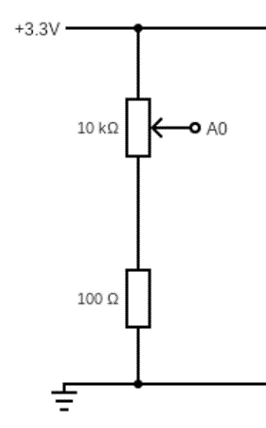

Rapid Embedded Systems - Design and Programming Course - Rev 1.0

[Table of Contents](/README.md#syllabus)

---


---

# Module 11 - Final Lab

# 1 Introduction

## 1.1 Lab overview

In this lab, we will remake the audio player with the following features:
* Users will be able play 8 different songs using four buttons
* Users will be able to stop and replay the song from the audio player
* Users will be able to display the name of a song that is being played in the LCD
* Users will be able to display a confirmation message when choosing the song in the LCD
* Users will have 5 seconds to confirm the song that they want to play
* Users will be able to see the state of the audio player using RGB LEDs (playing song, waiting for next song, no playing song)
* Users will display the instructions for using the audio player via UART
* Users will be able to adjust the volume of a song 
* Users will be able to execute these features in three threads

By the end of this lab you will have built your own “MP3 player” and you should feel confident about the techniques and concepts that you have learned during this course. 


# 2 Requirements

## 2.1	Software and Hardware

In this lab, we will be using the following software and hardware: 

* SOFTWARE - one of the following:

   * **Mbed Studio**, an IDE designed to streamline development and prototyping using Mbed enabled microcontrollers and development boards: https://os.mbed.com/studio/
    
   * **Mbed online compiler**, which can be found here: https://ide.mbed.com/compiler

* **NUCLEO-F401RE**, or another suitable Mbed OS 6 compatible development board. A full list of compatible devices can be found here: https://os.mbed.com/platforms, note that outputs may have to be reconfigured for devices following a different standard.

* A breadboard,4 x 330 Ω resistors, 4 x buttons, 1 x 100Ω resistor, 1 x 10kΩ potentiometer,1 x LCD (NHD_0216HZ), 1 x shift register (74HC595N), 1 x speaker (ABI-001-RC).


# 3 Hardware Setup

## 3.1 Pin Layout

In this experiment, we are going to use the Nucleo F401RE board. The pin descriptions for the board can be found below:

<figure>

<figcaption>Figure 1: The NUCLEO F401RE board pin descriptions</figcaption>
</figure>

On 2 breadboards, build the circuits in Figure 2, using the hardware components listed in 2. [“2. Requirements”](#2-Requirements):

<figure>




<figcaption>Figure 2: Circuit Layouts</figcaption>
</figure>

Connect the LEDs and the pins on the circuits to their relative pin which are defined in the table below. 

| Pin | Pin name in Mbed API |
| - | - |
| Potentiometer 1 | A0 |
| PWM speaker | D9 |
| BUTTON 1 | D2 |
| BUTTON 2 | D3 |
| BUTTON 3 | D4 |
| BUTTON 4 | D5 |
| RED LED | D6 |
| GREEN LED | D7 |
| BLUE LED | D8 |
| LCD SPI MOSI | D11 |
| LCD SPI MOSI | D13 |
| LCD SPI CS | D10 |
| USB UART TX | D1 |
| USB UART RX | D0 |
| - |


# 4	Final Lab

In this lab, we will build our own “MP3 player”, for the sake of this lab, students do not need to generate the songs like they did in lab 8. Students should download the following files: NHD_0216HZ.h, NHD_0216HZ.cpp, song.h ,song_def.h and main.cpp.  These files should be placed in the same directory.

## 4.1 Song_def.h

There is in total 10 different songs that have been provided for this lab, each of these songs have their own name (that has been split into two attributes name1 and name2), notes, beats, tempos or speed, and length. In order to access these attributes, you can: 
**`<SONG>.note[noteIndex]`** or **`*(<SONG>.note + noteIndex)`**

> *Note: There are **no notes** in the songs provided, please take care when dealing with them. It might be useful to review the module 8 lab solution to remember how to play a song.*

## 4.2 Timeout vs Ticker

The Ticker interface is used to setup a **recurring interrupt to repeatedly call a function** at a specified rate whereas Timeout setup **an interrupt to a call function** after a specified delay. For instance, if we have the following code:

```C++
Ticker tickerflipper;
Timeout timeoutflipper;
DigitalOut led1(LED1);
DigitalOut led2(LED2);

void tickerFlip() {
    led1 = !led1;
}
void timeoutFlipper() {
    led2 = !led2;
}
int main() {
    led1 = 1;
    led2 = 1;
    tickerflipper.attach(&tickerFlip, 2.0); // the address of the function to be attached (flip) and the interval (2 seconds)
    timeoutflipper.attach(&timeoutFlipper, 2.0); // setup flipper to call flip after 2 seconds
    // spin in a main loop.
    while(1) {
        wait(0.2);
    }
}
```

After two seconds **led1 and led2** will turn off, but after another two more seconds **just led1** will turn on because the tickerFlip function will execute as long as the program continues while the timeoutFlipper will just executed once, **unless is setup again**.

## 4.3 Your Application Code

In this exercise, you are required to complete the main.cpp provided and fulfil the following requirements:
* Define inputs and outputs that are missing.
* Complete the functions update_lcd_leds_thread(), adjust_volume() and polling_buttons().
* Use buttons 2 – 4 to insert a song in binary form from the **array of songs. For instance**, if the all the buttons are low or they are zero then we would end up playing the first song.
* While the buttons (2-4) are being pressed, press button 1 to select a song and then release all the buttons.
* Press button 1 again to confirm your choice, if you don’t do anything for 5 seconds, everything will continue normally.
* Display name of the song on the LCD when playing and a confirmation message when changing the song.
* Use the timeout and ticker interface to wait for the 5 seconds of confirmation and play music respectively.
* Use USER_BUTTON to stop/play a song.
* When a song is played the blue LED should be on 
* When a song is paused the red LED should be on
* When changing a song the green LED should be on
* Create 3 threads to:
    1.	Update the LCD and RGB LEDs
    2.	Polling buttons 
    3.	Adjust the volume
* Note that:
  - Every thread contains an infinite loop
  - Tasks are scheduled in a cooperative manner, namely, threads can go to waiting state after each update, to let the next thread be scheduled
  - Since the LCD must be accessed exclusively, we need a mutex to protect its single access.
* In the main program:
  - Clear the LCD display
  - Start all threads
  - Send the instruction of how to use the audio player via UART
  - Use sleep mode to reduce power consumption

---

[Table of Contents](/README.md#syllabus)

Copyright © 2021 Arm Limited (or its affiliates). All rights reserved. 