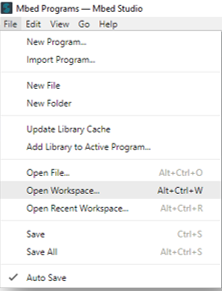
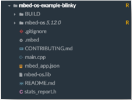
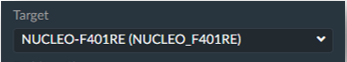
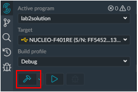
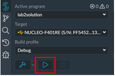
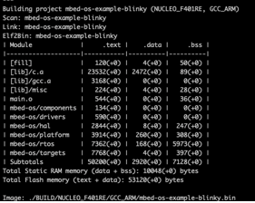

Rapid Embedded Systems - Design and Programming Course - Rev 1.1

[Table of Contents](/Getting_Started.md#syllabus)

---


# Module 4 - Getting Started Guide

## Lecture Slides

The lecture slides relevant to this section are listed below. It is suggested you follow these first before attempting the lab materials.

| Lecture | Description |
| - | - |
| 4 | [Introduction to the Mbed Platform and CMSIS](./Module_4.pptx) |
| |

# 1	Introduction
## 1.1	Course Labs Overview
Throughout the labs in this course, we will utilise several tools that can be used to easily prototype and develop for embedded devices. Complementary to the content shown in the lectures, the labs will provide hands on experience making use of the capabilities of MCU development boards.

The labs will be centred around the Mbed platform, which aims to provide a universal API and development environment for MCU boards. This means that applications developed in these labs should work with a large range of different hardware.

This first lab will focus on getting started with Mbed studio, the Mbed Command-line Interface (CLI), and the Mbed-Simulator.

## 1.2	Scope of this Guide
This getting started guide should give you enough information to set up and start working with Mbed Studio, Mbed CLI, and Mbed Simulator.

Note that some labs in the course may require more specific set-up than is covered here - anything additional will be introduced and explained as necessary for each lab.

# 2	Requirements
## 2.1	Software and Hardware
In the following labs we will be using the following software and hardware: 

* Mbed Studio, an IDE designed to streamline development and prototyping using Mbed enabled microcontrollers and development boards. Can be found here: https://os.mbed.com/studio/

OR

Mbed online compiler, which can be found here: https://ide.mbed.com/compiler

* NUCLEO-F401RE, or another suitable Mbed OS 5 compatible development board. A full list of compatible devices can be found here: https://os.mbed.com/platforms, note that outputs may have to be reconfigured for devices following a different standard.

* A breadboard, 4 x 330 Ω resistors, 4 x buttons, 1 red LED, 1 blue LED, 1 green LED.

# 3	Mbed Studio Setup
## 3.1	Mbed Studio
Mbed Studio is a free IDE that allows developers to create Mbed OS 5 applications and libraries. This will provide the functionality we require for completing the further labs. 

Ensure that you have installed Mbed Studio from the following link: https://os.mbed.com/studio/.

You will also need to register an account and use it to sign in when launching the IDE.

### 3.1.1	Preparing a workspace
Upon installation of Mbed Studio, a workspace named “Mbed Programs” is created for you in your home directory. A workspace is a location in the filesystem that contains your Mbed programs. This includes both imported and created projects. 

You can change this workspace by clicking “File” and then selecting “Open Workspace”. Navigate to the folder you wish to make the new workspace and select it. 

<figure>

<figcaption>Figure 1: Mbed Studio - “File” - “Open Workspace” </figcaption>
</figure><br>


### 3.1.2	Creating or importing programs
In Mbed Studio you can create your own programs or import pre-created programs into the IDE.

In order to create a new program:
1)	Open the “File” menu and select “New Program”.
2)	To start a program from scratch, select “Empty Mbed OS program” from the dropdown list. Or select one of the pre-written example programs.
3)	Give the program a name in the “Program Name” field then click “Add Program” (Note: “make this the active program” should automatically be ticked).

The program should then show up in the explorer on the left-hand side of the IDE as shown:

<figure>

<figcaption>Figure 2: Mbed Studio - New program </figcaption>
</figure><br>
<br>


Let’s repeat the process, but this time, we will import a project called “mbed-os-example-blinky”.
1)	Open the “File” menu and then select “New Program”.
2)	Select “mbed-os-example-blinky” from the dropdown list and then click “Add Program”.
The example program should now appear in the explorer and be populated with the relevant files (this may require reopening the workspace to work):

<figure>

<figcaption>Figure 3: Mbed Studio - “mbed-os-example-blinky” </figcaption>
</figure><br>

### 3.1.3	Build and running a program
Now you can plug in your Mbed enabled board and select it from the list of targets, in this case we will be using the Nucleo-F401RE:

<figure>

<figcaption>Figure 4: Mbed Studio - Target board </figcaption>
</figure><br>
<br>
Once the board is selected, ensure that “mbed-os-example-blinky” is the current active program and then select the “Build program” button:

<figure>

<figcaption>Figure 5: Mbed Studio - Build program </figcaption>
</figure><br>
<br>
As a result of the build process, Mbed will create a .bin file, which will contain result of compiling your program into machine code for whichever device you are using. Copying this file to your boards internal storage will have the effect of loading the program onto your board, at which point the program (for instance a blinking LED) should run!

<figure>

<figcaption>Figure 6: Mbed Studio - Run program </figcaption>
</figure><br>
<br>
Alternatively, pressing “Run program” should automatically build and load the program to your board. You may need to press the reset switch on the board in order for the new program to run.

# 4	Mbed CLI
Mbed Studio is a free python-based command-line tool that enables developers to work with Mbed offline. Through the CLI you can use all the standard features of Mbed studio, including making and importing programs as well as compilation. It also supports version control through both git and mercurial.

## 4.1	Installation and Setup
Installers are available for Windows and macOS and can be found here: 
https://os.mbed.com/docs/mbed-os/v6.15/quick-start/build-with-mbed-cli.html

There is no installer for Linux, you can follow the manual installation guide: 
https://os.mbed.com/docs/mbed-os/v6.15/build-tools/install-and-set-up.html

## 4.2	Creating or importing programs
Using Mbed-CLI, you can create your own programs or import pre-created programs and add or remove libraries.

### 4.2.1	Creating a program
In order to create a new program (called mbed-os-program), run:

```C
$ mbed new mbed-os-program
```

This will create a new folder mbed-os-program, initializes a new repository and imports the latest revision of the mbed-os dependency to your program tree.

Note that Mbed CLI uses the current directory as a working context, in a similar way to Git, Mercurial and many other command-line tools. This means that before calling any Mbed CLI command, you must first change to the directory containing the code you want to act on. 

For example, if you want to list all the imported libraries in your project:

```C
$ cd mbed-os-program
$ mbed ls -a
```

To list all Mbed CLI commands, use mbed --help. A detailed command-specific help is available by using mbed <command> --help.

Now, in the project directory, create main.cpp file and write your down your code.

### 4.2.2	Importing a program
In order to import a program, run ```$ mbed import < project link > ```:

``` $ mbed import https://github.com/ARMmbed/mbed-os-example-blinky```

With Mbed CLI you can import hosted repositories from GitHub, GitLab and mbed.org.

4.2.3	Managing libraries 

Use the ```$ mbed add < project link >``` command to add a library to a program.

Use ```$ mbed remove < library name >``` command to remove a library from your project.

Use ``` $ mbed update ``` command to update a library in your project. As with any Mbed CLI command, mbed update uses the current directory as a working context. 
For example, if you're updating mbed-os, use ``` $ cd mbed-os``` before you begin updating.

## 4.3	Compile and run a program
### 4.3.1	Setting a default target and toolchain 

In order to detect the supported targets and toolchains on your device, run:
```C
$ mbed detect
```
You should have an output similar to:

<figure>

<figcaption>Figure 7: Mbed Studio - Detected target  </figcaption>
</figure><br>
<br>
To set a default target, use the mbed target command with the name of your target (in this example, the NUCLEO_F401RE), run:

$ mbed target NUCLEO_F401RE

To set a default toolchain (in this example GCC_ARM), run:
```C
$ mbed toolchain GCC_ARM
```

### 4.3.2	Compile and Run 

In order to compile your project, run in your project directory:
```C
$ mbed compile
```

<figure>

<figcaption>Figure 8: An example for the NUCLEO_F401RE and ARM Compiler  </figcaption>
</figure><br>
<br>
To run, the project, copy the .bin file (in this example mbed-os-example-blinky.bin) from ./BUILD/<target name> to your device.

More Mbed commands can be found: 
https://os.mbed.com/docs/mbed-os/v6.15/build-tools/index.html
