Rapid Embedded Systems - Design and Programming Course - Rev 1.1

[Table of Contents](/Getting_Started_Docker.md#syllabus)

---


# Module 4 - Getting Started Guide

## Lecture Slides

The lecture slides relevant to this section are listed below. It is suggested you follow these first before attempting the lab materials.

| Lecture | Description |
| - | - |
| 4 | [Introduction to the Mbed Platform and CMSIS](./Module_4.pptx) |
| |

# 1	Requirements
This section describes the software requirements for running the Mbed Simulator. 
## 1.1	Software requirements
The following table is a list of recommended software tools that you need to run the Mbed Simulator.

| Software	| Website	| Version |	OS |
| - | - | - | - |
| Docker Desktop Installer |	https://www.docker.com/products/docker-desktop | Use the most stable version. | Windows 10</br> Mac OS 10.13 or newer </br>  Ubuntu Focal 20.04 (LTS) |
|Browser	| -	|	Chrome </br>  Mozilla Firefox|	-|

Note:
*	For these course labs, you do not need to have Git installed. 
*	Read System Requirements for Docker Desktop in
*	https://docs.docker.com/docker-for-windows/install/
*	https://docs.docker.com/docker-for-mac/install/
*	For other Linux distributions, you may need to install Docker Engine if there isn’t a Linux version of Docker Desktop. See https://docs.docker.com/engine/install/

# 2	Setting up Docker on your PC
Docker is a platform that uses OS-level virtualization to deliver software. The Mbed Simulator image file is hosted in Docker so that you can easily access the Mbed Simulator without having to build it manually. You will need to install Docker so that you can access the Mbed Simulator image file. 

## 2.1	Windows users: Downloading and installing Docker Desktop
To install Docker Desktop on Windows, follow these steps:
1.	Download the appropriate Docker Desktop Installer program from the link provided in Software requirements.

2.	Run the downloaded Docker Desktop installer. You can accept the default configuration where appropriate and click OK. 
<figure>
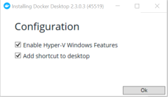
<figcaption>Figure 1: Installing Docker Desktop </figcaption>
</figure>

Note: It may take some time for the Installer to unpack the files. If the installation is successful, there will be an ‘Installation succeeded’ display. 

<figure>
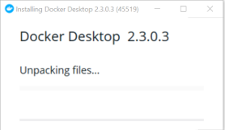
<figcaption>Figure 2: Unpacking files </figcaption>
</figure>

3.	Click Close and restart. This will restart your PC.

<figure>
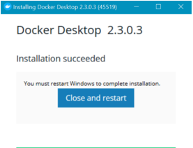
<figcaption>Figure 3: Installation succeeded </figcaption>
</figure>
After restarting your PC, you will notice Docker in your Windows system tray, for example:

<figure>
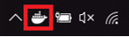
<figcaption>Figure 4: Docker in Windows system tray </figcaption>
</figure>
For more information, see https://docs.docker.com/docker-for-windows/install/

## 2.2	Mac users: Downloading and installing Docker Desktop
To install Docker Desktop on your Mac, follow these steps:

1.	Download the appropriate Docker Desktop Installer program from the link provided in Software requirements.

2.	Open the downloaded installer (double click on the .dmg file). 

3.	Drag and drop Docker.app to Applications. 

<figure>
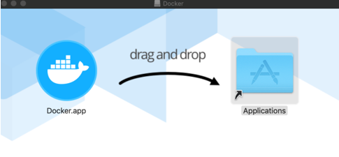
<figcaption>Figure 5: Docker.app </figcaption>
</figure>

4.	Open the Applications folder and double click on Docker.app. 
You will notice Docker in the top status bar that indicates that Docker is running, for example:

<figure>

<figcaption>Figure 6: Docker in status bar </figcaption>
</figure>

For more information, see https://docs.docker.com/docker-for-mac/install/

## 2.3	Ubuntu users: Downloading and installing Docker 
For Linux OS users, you may need to check if Docker Desktop has available installers for Linux. If there isn’t any, you will need to install Docker Engine instead. 
Note: The instructions in this section are specifically for Ubuntu users. If you are using a different OS, follow the instructions in https://docs.docker.com/engine/install/

To set up Docker in Ubuntu Focal 20.04 (LTS), follow these steps:
1.	Set up the Docker repository as shown in https://docs.docker.com/engine/install/ubuntu/
by running the following commands:
```
sudo apt-get update
```
```
sudo apt-get install \
    apt-transport-https \
    ca-certificates \
    curl \
    gnupg-agent \
    software-properties-common
```
```
curl -fsSL https://download.docker.com/linux/ubuntu/gpg | sudo apt-key add -
```
2.	Verify that you now have the correct key by entering the command:
```
sudo apt-key fingerprint 0EBFCD88
```
	You should expect a message that displays:
```
pub   rsa4096 2017-02-22 [SCEA]
      9DC8 5822 9FC7 DD38 854A  E2D8 8D81 803C 0EBF CD88
uid           [ unknown] Docker Release (CE deb) <docker@docker.com>
sub   rsa4096 2017-02-22 [S]
```
3.	Set up a stable repository. For an x86_64/amd64 system, run the following command:
```
sudo add-apt-repository \
   "deb [arch=amd64] https://download.docker.com/linux/ubuntu \
   $(lsb_release -cs) \
   stable"
``` 
Note: If you are using an armhf or arm64 system, replace arch=amd64 with arch=armhf or arch=arm64 respectively. 

4.	Update the apt package index:
```
sudo apt-get update
```
5.	Install containerd and the latest version of Docker Engine by running the following commands:
```
sudo apt-get install docker-ce docker-ce-cli containerd.io
```
6.	List the Docker Engine versions available in your repo: 
```
apt-cache madison docker-ce
```
You will get a message similar to the following snapshot, which will list the various versions:

<figure>
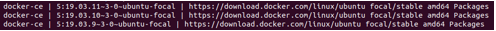
<figcaption>Figure 7: Snapshot of the message </figcaption>
</figure>

7.	Install a specific version using the version string from the second column. For example, to install version ``` 5:19.03.11~3-0~ubuntu-focal``` which is listed in the above snapshot, run the following command:
``` 
sudo apt-get install docker-ce=5:19.03.11~3-0~ubuntu-focal docker-ce-cli=5:19.03.11~3-0~ubuntu-focal containerd.io
``` 
You will get a message similar to the following snapshot: 

<figure>
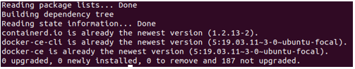
<figcaption>Figure 8: Snapshot Docker install </figcaption>
</figure>

8.	Test that Docker Engine has been installed correctly by running a ‘hello world’ image: 
``` 
sudo docker run hello-world
``` 
You will get a message similar to the following snapshot: 

<figure>
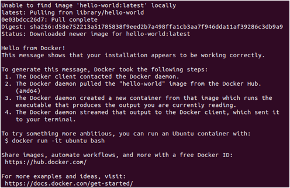
<figcaption>Figure 9: Docker test message </figcaption>
</figure>

If you are unable to use the Docker’s repository to install Docker Engine, you can manually download the .deb file and install it. Read the Install from a package section in  https://docs.docker.com/engine/install/ubuntu/

Additional reference:
*	https://www.youtube.com/watch?v=V9AKvZZCWLc
 
# 3	Accessing Mbed Simulator
## 3.1	Windows and Mac users: Downloading and Running Mbed Simulator image files with Docker Desktop

To download the Mbed Simulator image files in a Windows or Mac OS, follow these steps: 
1.	Ensure that you have successfully installed Docker Desktop as described in Downloading and installing Docker Desktop.

2.	Open a terminal command prompt and run the following command to download the necessary Mbed Simulator image files: 
``` 
docker pull armedu/mbed_sim
``` 
Note: 
*	The downloading may take some time.
*	You should not need to install Git in order to run the docker commands. 
Once completed you should get a display similar to the following: 

<figure>
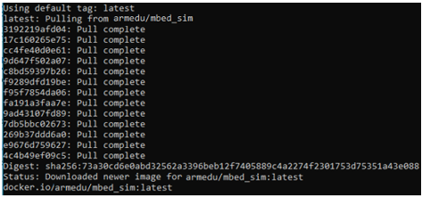
<figcaption>Figure 10: Mbed simulator pull result </figcaption>
</figure>

3.	Run the Mbed Simulator by entering the following command: 
docker run -p 7829:7829 armedu/mbed_sim

You should get the following message:

<figure>
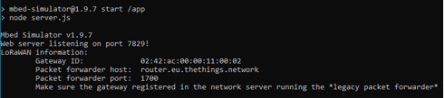
<figcaption>Figure 11: Mbed simulator run result </figcaption>
</figure>

4.	Expand your OS system tray (or status bar, depending on your OS), and right click on the Docker Icon. Then select Dashboard. 

<figure>
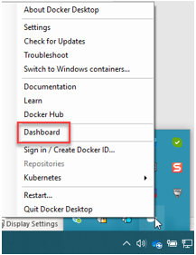
<figcaption>Figure 11: Windows OS - Docker Icon - Dashboard  </figcaption>
</figure>


<figure>
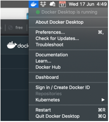
<figcaption>Figure 12: MAC OS - Docker Icon - Dashboard  </figcaption>
</figure>

5.	Hover your mouse over the relevant container named ‘mbed_sim’ and select ‘Open in Browser’. 


<figure>
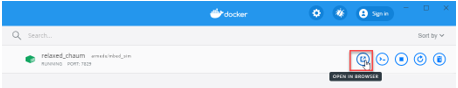
<figcaption>Figure 13: Relevant container ‘mbed_sim’  </figcaption>
</figure>

A browser will now launch with the Mbed Simulator as shown in the following diagram.

<figure>
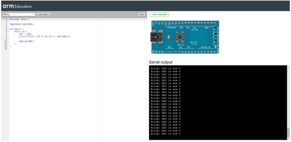
<figcaption>Figure 14: Mbed Simulator  </figcaption>
</figure>
If you wish to stop the container by pressing the stop icon in the Docker Dashboard. You can also restart it by pressing the start icon in the Docker Dashboard. 

## 3.2	Ubuntu users: Downloading and Running Mbed Simulator image files with Docker Engine

To download the Mbed Simulator image files in Ubuntu, follow these steps: 
1.	Ensure that you have successfully installed Docker Desktop and restarted your PC as described in Downloading and installing Docker Desktop.

2.	Open a terminal command prompt and run the following command to download the necessary Mbed Simulator image files: 
```
sudo run docker pull armedu/mbed_sim 
```
Note: 
*	The downloading may take some time.
*	You should not need to install Git in order to run the docker commands.

Once completed you should get a display similar to the following: 

<figure>
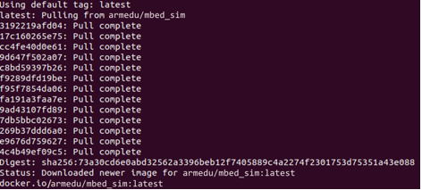
<figcaption>Figure 15: Pull complete  </figcaption>
</figure>

3.	Run the Mbed Simulator
```
sudo docker run -p 7829:7829 armedu/mbed_sim 
```
You should get the following message:
<figure>
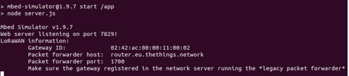
<figcaption>Figure 16: Run the Mbed Simulator  </figcaption>
</figure>

4.	Open a browser in Ubuntu and enter the following URL:
```
http://localhost:7829/ 
```
A browser will now launch with the Mbed Simulator as shown in the following diagram.

<figure>
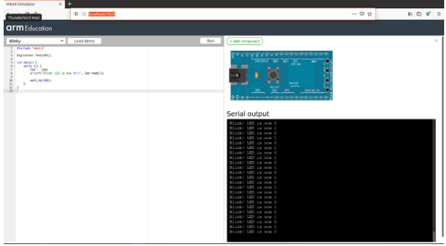
<figcaption>Figure 17: Mbed Simulator diagram </figcaption>
</figure>

5.	[Optional] If you would like to list all running docker containers, run the following command in a separate terminal: 
```
sudo docker ps
```
	You should get a list similar to: 

<figure>
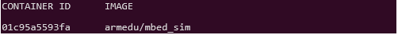
<figcaption>Figure 18: List with all running docker containers </figcaption>
</figure>
You can also stop the container by entering the following command: 

```
sudo docker container stop <container id>
```
So for example, if your container id is 01c95a5593fa, then run the command:  
```
sudo docker container stop 01c95a5593fa
```
To restart it again, run the command:
```
sudo docker container start 01c95a5593fa
```
# 4	Troubleshooting
## 4.1	No sound in Mbed Simulator
If there is no sound when running Module 6 – Solution in the Mbed Simulator, ensure that you are using the browsers stated in **1.1 Software requirements**. 

## 4.2	Docker Desktop prompts message on Hyper-V features being disabled in Windows
As mentioned in https://docs.docker.com/docker-for-windows/install/, it is a system requirement for Hyper-V and Containers to be enabled in Windows Features in order to run Docker. 

To enable Hyper-V and Containers, follow these steps:
1.	Type “Windows Features” in your Windows search taskbar. This will bring up the option of Turn Windows features on or off in the search. 

2.	Click on Turn Windows features on or off.

3.	Ensure that Hyper-V and Containers checkboxes are both filled, as shown below: 

<figure>
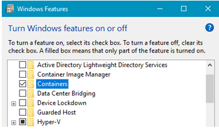
<figcaption>Figure 19: Containers and Hyper-V are checked </figcaption>
</figure>
4.	Click OK and restart your PC. 

## 4.3	Cannot start docker in Windows – Error response from daemon
If you get the following error message when running the docker pull command:
```
'error during connect: Get http://%2F%2F.%2Fpipe%2Fdocker_engine/v1.40/version: open //./pipe/docker_engine: The system cannot find the file specified. In the default daemon configuration on Windows, the docker client must be run elevated to connect. This error may also indicate that the docker daemon is not running'
```
You can try the following:
1.	Right-click on the Docker icon in your Windows System Tray. 
2.	Select restart. 
3.	Once Docker has successfully connected, enter the docker pull <name> command again. 
