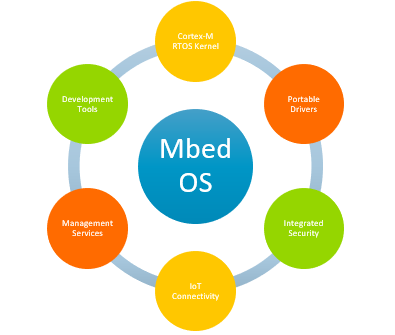
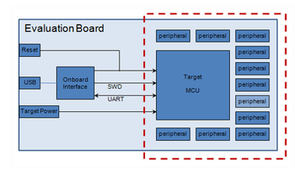
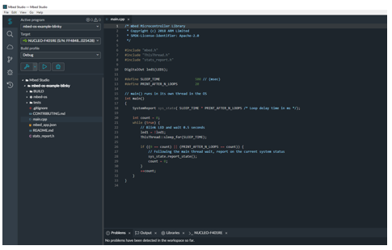
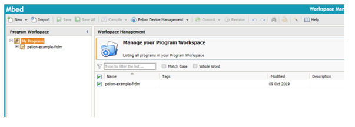
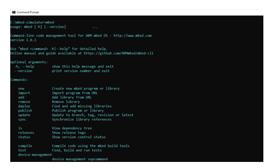
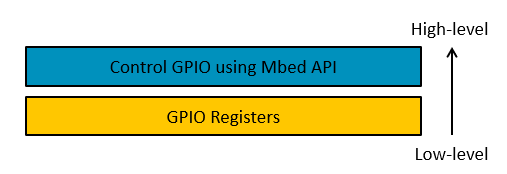
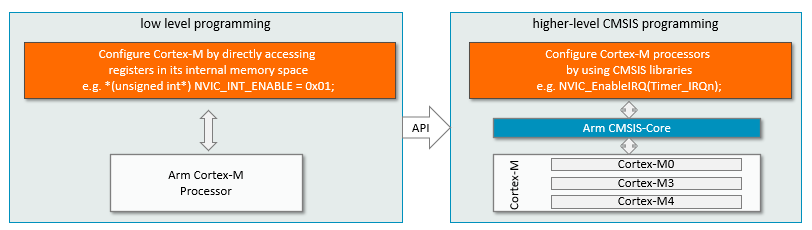
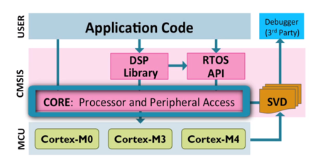
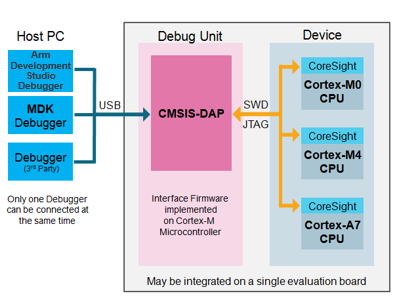

Rapid Embedded Systems - Design and Programming Course - Rev 1.1

[Table of Contents](/README.md#syllabus)

---


---

# Module 4 - Introduction to the Mbed Platform and CMSIS

## Lecture Slides

The lecture slides relevant to this section are listed below. It is suggested you follow these first before attempting the lab materials.

| Lecture | Description |
| - | - |
| 4 | [Introduction to the Mbed Platform and CMSIS](./Module_4.pptx) |
| |

If you clone this repository, lecture slides are available in PowerPoint format in the folder `Materials/Module_4`

# 1 Introduction

* What is Mbed?

    - A platform used for the easy prototyping and development of applications and systems based on Arm Cortex-M-based microcontrollers, typically for use in the world of the Internet of Things (IoT).

* The Mbed platform provides:
    - Open software libraries.
    - Open hardware designs .
    - Open online tools for professional rapid prototyping of products based on Arm-based microcontrollers.

* The Mbed platform includes:
    - Mbed Operating System (Mbed OS).
        - Libraries, RTOS core, HAL, API, and more.
    - A microcontroller Hardware Development Kit (HDK) and supported development boards.
    - Integrated Development Environment (IDE), including an online compiler and online developer collaboration tools.

<!-- The Mbed platform provides a full set of resources necessary and useful for developers of Arm Cortex-M-based systems. It is an online system, supported by a broad community and microcontroller companies, offering:
* Mbed OS 5
* Driver libraries (libs) 
* Hardware development kits (HDK) with sample layouts 
* A complete IDE with compiler and collaboration tools -->

# 2 Mbed OS - Overview
<figure>

<figcaption>Figure 1: MbedOS features </figcaption>
</figure>

* An open-source operating system for platforms using Arm microcontrollers, specifically designed for devices involved in the Internet of Things (IoT).

* Offers a variety of features to enable the development of IoT connected systems.

* Provides a layer of abstraction that interprets the application code in way the hardware can understand.

* This enables the developer to focus on programming applications that can run on a range of devices.
* An Mbed OS application can be run on any Mbed-compatible platform.

##  2.1 Mbed OS – Cortex-M RTOS Kernel 
Mbed has an RTOS core.
* Supports deterministic, multithreaded, real-time software execution.

RTOS primitives are available to allow drivers and applications to rely on threads, semaphores, mutexes and other RTOS features.

## 2.2 Mbed OS - Security

Mbed provides two security-focused embedded building blocks:
* Arm Mbed TLS.
* Secure Partition Manager (SPM).

Mbed TLS is a protocol for securing communication channels between devices and servers or gateways.

The secure partition manager is responsible for:
* Isolating software within partitions.
* Managing the execution of software within partitions.
* Providing Inter-Process Communication (IPC) between partitions.

## 2.3 Mbed OS - Connectivity

Mbed OS supports a number of connectivity protocols.
* Paired with Pelion Device Management to provide full support for a range of communication options.

Such technologies include:
* NarrowBand-IoT (NB-IoT).
* Bluetooth Low Energy (BLE).
* 6LoWPAN.
* Thread.

## 2.4 Mbed Software Development Kit

It is a rich toolbox that supports developers by providing guides and code segments for already solved problems.
Many of these software tools, such as BTLE-stacks or start-up codes, are continuously maintained by the community for faster code development.

* Mbed Software Development Kit (SDK) includes:
    * Software libraries.
        * Official C/C++ software libraries.
            * Start-up code, peripheral drivers, networking, RTOS and runtime environment.
        * Community-developed libraries and codes.
            * Cookbook of hundreds of reusable peripheral and module libraries have been built on top of the SDK, which can be used to build your projects faster.
    * Software tools, such as build tools, test and debug scripts.
* Enables rapid prototyping of embedded applications.


## 2.5 Mbed Hardware Development Kit 

The Mbed Hardware Development Kit (HDK) consists of different hardware design resource that assist in the development of custom hardware.
* Allows utilisation of the Arm Mbed ecosystem and associated technologies such as Mbed OS and DAPLink.

Working with boards based on the Mbed HDK allows for an efficient start to working with the Mbed platform.

The HDK offers:
* Eagle schematics and board files.
* PDF schematics and board copies.
* CAM Job GERBERS for manufacture (including pick/place and drill).
* Bill of Materials (BOM).
* A repository of content and projects.
 
Benefits of the Mbed HDK:
* Quick design short-cut.
    * Using ready-made schematics.

* Easy-to-use USB and debugging support.

* Compatible with Mbed OS.

<figure>

<figcaption>Figure 2: An example of how a microcontroller sub-system might be used to build an evaluation board
 </figcaption>
</figure>

# 3 DAPLink 
Open Source project that implements the embedded firmware required for a Cortex debug probe. Complemented by numerous reference designs that enable creation of DAPLink debug probe hardware.

The DAPLink debug probe is connected to the host computer via USB and connects to the target system through a standard Cortex debug connecter.

Features – provided via USB connection:
* HID interface
    * Provides a channel over which CMSIS-DAP protocols can run.
    * Enables tools such as Keil MDK, IAR Workbench, and pyOCD.

* USB drag and drop programming
    * The DAPLink debug probes appear as a USB disk on the host computer.
    * Binary and hex files can be copied to the USB disk which are then programmed into the memory of the target system.

* USB serial port
    * DAPLink probe also provides a USB serial port.
    * Port will appear on a Windows as a COM port or Linux as a /dev/tty interface.

# 4 Development Tools

There are multiple ways for developers to program with Mbed. These consist of:
* Mbed Studio and Keil Studio
* Mbed Online Compiler
* Mbed CLI

## 4.1 Mbed Studio
<figure>

<figcaption>Figure 3: Mbed Studio IDE
 </figcaption>
</figure>

* Integrated development environment (IDE) for Mbed OS 5 applications.
    * Includes everything required to create, compile and debug Mbed programs.
    * Automatically detects connected Mbed enabled boards. 
    * Quick development for specific targets.
    * Flashes code directly to connected platform.
    * Provides debug session for debugging and profiling the target board.

A new web version of Mbed Studio is now included in the upcoming [Keil Studio Cloud](https://studio.keil.arm.com/). This is a zero-install alternative that offers almost the same functionality. 

## 4.2 Legacy Mbed Online Compiler

**Note**: This is a legacy IDE that is no longer being developed.

<figure>

<figcaption>Figure 4: Mbed Online Compiler
 </figcaption>
</figure>

* A lightweight online C/C++ IDE that enables quick writing of programs, compilation, and running on a microcontroller.

* No prior-installation or set-up required to work with Mbed.

* Includes full code editor, version control, and library management.
 

## 4.3 Mbed CLI

<figure>

<figcaption>Figure 5: Mbed CLI
 </figcaption>
</figure>

* Arm Mbed CLI is a command-line tool packaged as ‘mbed-cli’ and based on Python.

* Enables Git and Mercurial-based version control, along with dependency management, code publishing, support for remotely hosted repositories, and use of the Arm Mbed OS build system.

# 5  Testing with Mbed

The Mbed platform offers a number of tools that support testing of your Mbed code. One of them is:

* Greentea
    * Automated testing tool for Arm Mbed OS development.
    * Pair with 'UNITY' and 'utest' frameworks.
    * https://os.mbed.com/docs/mbed-os/v6.15/debug-test/greentea-for-testing-applications.html

Process of flashing boards, running the tests, and generating reports is automated by the test system.

# 6 Mbed Enabled Platforms

The Arm® Mbed Enabled™ program outlines a set of functionality and requirements that must be met in order to become “Mbed Enabled”. This can cover development boards, modules, components, and interfaces.

This benefits developers as they are assured that the platforms they choose to work with can perform certain functions/provide certain performance.

It is also beneficial to the vendors as it allows their products more exposure when certified, and enables their product to become more familiar with developers in the Mbed eco-system.

Some example boards include:
* NUCLEO-F401RE
* DISCO-F413ZH
* DISCO-F413ZH
* Nordic nRF51-DK

# 7 High-level vs. Low-level Programming

## 7.1 High-level Programming
Advantages:
* Higher productivity (less development time).
* Portability across devices. 
* Resulting code that is easier code to read and maintain.
* Allows reuse of code.
* Rapid prototyping of applications.
	
Disadvantages:
* Less optimized code.
* Additional translation time for source to machine code.
* Another level of abstraction to deal with.

## 7.2 Low-level Programming
Advantages:
* More optimized code and memory efficient.
* Less translation time for source to machine code.
* Directly talk to hardware.

Disadvantages:
* Less portability from one device to another.
* Resulting code is more difficult for others to read, reuse, and maintain.
* Low productivity.

## 7.3 Comparison: High-level vs Low-level
MCU register layer
* Blinky example by poking registers.

Mbed API 
* Blinky example using Mbed API functions.

<!-- MODULE 4 COMPARATION HIGH VS LOW LEVEL PROGRAMMING -->
<figure>

<figcaption>Figure 6: High-level vs Low-level </figcaption>
</figure>

### 7.3.1 MCU Register Example
As shown in previous modules, the GPIO peripheral can be directly accessed by writing/reading specific memory addresses:
* Assign a pointer to the address of each register.
* Registers can be read/ written to using the pointer.

Example of low-level programming:

```C
#include "mbed.h"
DigitalOut led1(LED1); //Let Mbed OS initialise PA_5

int main(){

    //Let's have a look at the address of the BSRR register for PORTA
    uint32_t *p = (uint32_t*)0x40020018;
    printf("BSRR Address= %p\n", p);

    while(true){
 
        //Set PA_5 HIGH
        *p = 1<<5;
        wait_us(500000);

        //Reset PA_5 
        *p = 1<<21; 
        wait_us(500000);
    }
}
```
This code is the closest approach to assembly level: everything is coded with addresses and pointers. 

> Note - Normally this code would be much more complex, but for illustrative purposes, we have used the Mbed OS `DigitalOut` to perform the necessary port initialization, so we can focus on the blinking-function in the main routine.

The code is short and efficient, but is mostly unreadable if the purpose of the addresses is not known, and if the names of the variables are not self-describing. Besides using platform specific addresses, it also uses a "Bit Set Reset Register" (BSRR) which may not feature in all microcontrollers, making this code less portable as well.

We can improve matters by using some of the CMSIS definitions:

```C
#include "mbed.h"
DigitalOut led1(LED1); //Let Mbed OS initialise PA_5

#define SET_PIN_5 (1<<5)
#define RESET_PIN_5 (SET_PIN_5 << 16)

int main(){

    //Let's have a look at the address of the BSRR register for PORTA
    uint32_t *p = (uint32_t*)&(GPIOA->BSRR);
    printf("BSRR Address= %p\n", p);

    while(true){
 
        //Set PA_5 HIGH
        GPIOA->BSRR = SET_PIN_5;
        wait_us(500000);

        //Reset PA_5 
        GPIOA->BSRR = RESET_PIN_5; 
        wait_us(500000);
    }
}
```

This is much more readable if you know what a `BSRR` register mean (assuming your MCU supports it). Mbed OS can abstract away any need to make reference to register names and bit positions:

```C++
#include "mbed.h"
DigitalOut led1(LED1); //Let Mbed OS initialise PA_5
int main(){

    while(true){
 
        //Set PA_5 HIGH
        led1.write(1);
        wait_us(500000);

        //Reset PA_5 
        led1.write(0); 
        wait_us(500000);
    }
}
```

The implementation of write may use a `BSRR` register (if present), but that is a platform specific detail that is abstracted away for us.

At the highest level, by using C++ operator overloading, Mbed OS makes the code even more expressive:

```C++
#include "mbed.h"
DigitalOut led1(LED1); //Let Mbed OS initialise PA_5

int main(){

    while(true){
 
        //Set PA_5 HIGH
        led1 = 1;
        wait_us(500000);

        //Reset PA_5 
        led1 = 0; 
        wait_us(500000);
    }
}
```

It is key to note that once compiled, all the examples above perform the same function. As the code becomes more abstracted, it becomes easier to read, maintain and port to other devices. The trade-off for this is sometimes additional overhead, but this is minimal.

### 7.3.2 Mbed API Example

* The Mbed API provides the actual user-friendly object-oriented API to the final user.
* More friendly functions/APIs.
* Object oriented API (using C++).
* Top-level API used by the majority of the programs developed on the mbed platform.
* Defines basic operators to provide intuitive casting to primitive types and assignments.
* A digital IO class is defined as shown in the code clip.

Example of high-level programming:

```C
class DigitalInOut{

public:
    DigitalInOut(PinName pin)   {
        gpio_init(&gpio, pin, PIN_INPUT);
    }

    void write(int value)   {
        gpio_write(&gpio, value);
    }

    int read()  {
        return gpio_read(&gpio);
    }

    void output()   {
        gpio_dir(&gpio, PIN_INPUT);
    }

    void input()    {
        gpio_dir(&gpio, PIN_INPUT);
    }

    void mode(PinMode pull)   {
        gpio_mode(&gpio, pull);
    }

    DigitalInOut& operator= (int value)   {
        write(value);
        return *this;
    }

    DigitalInOut& operator= (DigitalInOut& rhs)   {
        write(rhs.read());
        return *this;
    }

}
```
The easiest and most understandable way to program an Arm-based Cortex-M controller is to use the mbed API. 
This slide shows an example of its code implementation. It shows the full C++ based abstraction, including operator functions.

With the support of the Mbed API, the same blinky example can be programmed in a much simpler and more intuitive way:

```C
#include "mbed.h"

DigitalInOut led1(LED1);


int main(){
    while(true){
        led1 = 1; 
        wait(0.5);

         led1 = 0; 
        wait(0.5);
    }
}
```
Stepping inside line **DigitalOut led1(LED1)**:

```C
class DigitalInOut {

public:
    DigitalInOut(PinName pin) {
        gpio_init(&gpio, pin, PIN_INPUT);
    }
```

The declaration of led1 already constructs and assigns it to LED1 as part of the evaluation board, with the correct ports and addresses. The assignment of 1 and 0in line **led1 = 1** or **led1 = 0** , lets it toggle on and off by writing the according values to the port (= address).This uses an operator function as shown below:

```C

DigitalInOut& operator= (DigitalInOut& rhs)   {
    write(rhs.read());
    return *this;
}

void write(int value)   {
    gpio_write(&gpio, value);
}
```
In this code, the use of addresses is completely encapsulated and invisible.


* Note that the Mbed API is programmed using the object-oriented language C++, which originated from C language with object-oriented features such as classes.
Deep knowledge of  C++ is not necessary to use the Mbed API. However, many tutorials and books can help you learn C++ if you wish. 

# 8 Cortex Microcontroller Software Interface Standard (CMSIS)

CMSIS: Cortex Microcontroller Software Interface Standard.

A vendor-independent hardware abstraction layer for the Cortex-M processor series.

Provides a standardized software interface, such as library functions, which help control the processor more easily, e.g. configuring the Nested Vectored Interrupt Controller (NVIC).

Improves software portability across different Cortex-M processors and Cortex-M based microcontrollers.

<figure>

<figcaption>Figure 7: Cortex Microcontroller Software Interface Standard</figcaption>
</figure>

## 8.1 What is Standardized by CMSIS?

Functions to access, e.g., NVIC, System Control Block (SCB) and System Tick timer
* Enables an interrupt or exception: NVIC_EnableIRQ (IRQn_Type IRQn)
* Sets pending status of interrupt: void NVIC_SetPendingIRQ (IRQn_Type IRQn)

Access to special registers e.g.
* Read PRIMASK register: uint32_t __get_PRIMASK (void)
* Set CONTROL register: void __set_CONTROL (uint32_t value)

Functions to access special instructions e.g.
* REV: uint32_t __REV(uint32_t int value)
* NOP: void __NOP(void)

Names of system initialization functions e.g.
* System initialization: void SystemInit (void)

<figure>

<figcaption>Figure 8: CMSIS Compliant </figcaption>
</figure>

## 8.2 Benefits of CMSIS

Easier to port application code from one Cortex-M based microcontroller to another Cortex-M based microcontroller.

Easier to reuse the same code between different Cortex-M based microcontrollers.

Better compatibility when integrating third-party software components, since all third-party components such as applications, embedded OS, middleware etc., can share the same standard CMSIS interface.

Better code density and smaller memory footprint, since the codes in CMSIS have been optimized and tested.

<figure>

<figcaption>Figure 9: CMSIS partners</figcaption>
</figure>

## 8.3 CMSIS Components
The CMSIS consists of the following components:
* CMSIS-CORE 
* CMSIS-DSP, CMSIS-RTOS API and CMSIS-SVD
* In this module, we will focus on using CMSIS-CORE

<figure>

<figcaption>Figure 10: CMSIS Components</figcaption>
</figure>

## 8.4 CMSIS-DAP

CMSIS-DAP is an interface firmware for the debug unit that connects the debug port to USB.
Debuggers can connect via USB to the debug unit and to the device running the application software.
The debug unit is connected to the target device via JTAG or SW.
The Arm-Cortex processors then provide the CoreSight Debug and Trace Unit.

<figure>

<figcaption>Figure 11: CMSIS-DAP</figcaption>
</figure>

## 8.5 CMSIS Functions: Access NVIC

| CMSIS Function	| Description |
| - | - |
| `void NVIC_EnableIRQ (IRQn_Type IRQn)` | Enables an interrupt or exception. |
| `void NVIC_DisableIRQ (IRQn_Type IRQn)` | Disables an interrupt or exception. |
| `void NVIC_SetPendingIRQ (IRQn_Type IRQn)` | Sets the pending status of interrupt or exception to 1. |
| `void NVIC_ClearPendingIRQ (IRQn_Type IRQn)` | Clears the pending status of interrupt or exception to 0. |
| `uint32_t NVIC_GetPendingIRQ (IRQn_Type IRQn)` | Reads the pending status of interrupt or exception. This function returns non-zero value if the pending status is set to 1. |
| `void NVIC_SetPriority (IRQn_Type IRQn, uint32_t priority)` | Sets the priority of an interrupt or exception with configurable priority level to 1. |
| `uint32_t NVIC_GetPriority (IRQn_Type IRQn)` | Reads the priority of an interrupt or exception with configurable priority level. This function return the current priority level. |


## 8.6 CMSIS Functions: Access Special Registers

| Special Register	| Access | CMSIS Function |
| - | - | - |
| PRIMASK | Read |`uint32_t __get_PRIMASK (void)` |
| PRIMASK | Write |`void __set_PRIMASK (uint32_t value)` |
| CONTROL | Read |`uint32_t __get_CONTROL (void)` |
| CONTROL | Write |`void __set_CONTROL (uint32_t value)` |
| MSP | Read |`uint32_t __get_MSP (void)` |
| MSP | Write |`void __set_MSP (uint32_t TopOfMainStack)` |
| PSP | Read |`uint32_t __get_PSP (void)` |
| PSP | Write |`void __set_PSP (uint32_t TopOfProcStack)` |


## 8.7 CMSIS Functions: Execute Special Instructions


| Instruction	| CMSIS Intrinsic Function |
| - | - |
| CPSIE i |`void __enable_irq(void)` |
| CPSID i |`void __disable_irq(void)` |
| ISB |`void __ISB(void)` |
| DSB  |`void __DSB(void)` |
| DMB  |`void __DMB(void)` |
| NOP  |`void __NOP(void)` |
| REV  |`uint32_t __REV(uint32_t int value)` |
| REV16 |`uint32_t __REV16(uint32_t int value)` |
| REVSH  |`uint32_t __REVSH(uint32_t int value)` |
| SEV  |`void __SEV(void)` |
| WFE  |`void __WFE(void)` |
| WFI |`void __WFI(void)` |

## 8.8 CMSIS Functions: Access System

| CMSIS Function	| Description |
| - | - |
| `void NVIC_SystemReset(void)` | Initiate a system reset request. |
| `uint32_t SysTick_Config(uint32_t ticks)` | Initialize and start the SysTick counter and its interrupt. |
| `void SystemInit (void)` | Initialize the system. |
| `void SystemCoreClockUpdate(void)` | Update the SystemCoreClock variable. |
