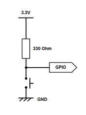

<style>
red { color: red }
yellow { color: yellow }
blue { color: CornflowerBlue}
green { color: green}
purple { color: MediumPurple}
</style>


# 1 Introduction

## 1.1 Lab Overview

In this lab, we will implement two functions in which the RGB LEDs are controlled by the status of the buttons. We will use the DigitalIn/DigitalOut and the BusIn/BusOut interfaces to assist with this. 
By the end of this lab you will get some insight and practical experience with the Mbed API for Digital I/O.

# 2 Requirements

## 2.1 Software and Hardware

In this lab, we will be using the following software and hardware:

- **Mbed Studio**, an IDE designed to streamline development and prototyping using Mbed enabled microcontrollers and development boards: https://os.mbed.com/studio/

    **OR**

    **Mbed online compiler**, which can be found here: https://ide.mbed.com/compiler

- **NUCLEO-F401RE**, or another suitable Mbed OS 5 compatible development board. A full list of compatible devices can be found here: https://os.mbed.com/platforms, note that outputs may have to be reconfigured for devices following a different standard.

- A breadboard, 4 x 330 Ω resistors, 4 x buttons, 1 red LED, 1 blue LED, 1 green LED.

The code skeleton, which includes some support for implementing the task at the end of this lab  should be found in the same folder as this manual.

# 3 Hardware Setup

## 3.1 Pin Layout

In this experiment, we are going to use the NUCLEO F401RE board. The pin descriptions for the board can be found below:


*F401RE Pinout Diagram*

On a breadboard, connect all 4 buttons according to the diagram on the left. Your buttons should pull the GPIO pin low. Then connect the buttons and the LED to their respective pin on the board as defined in the table below.

<table>
<tbody>
  <tr>
    <td></td>
    <td>
<table>
<tbody>
  <tr>
    <td>Pin</td>
    <td>Mbed Pin Name</td>
  </tr>
  <tr>
    <td>Button 1</td>
    <td>D2</td>
  </tr>
  <tr>
    <td>Button 2</td>
    <td>D3</td>
  </tr>
  <tr>
    <td>Button 3</td>
    <td>D4</td>
  </tr>
  <tr>
    <td>Button 4</td>
    <td>D5</td>
  </tr>
  <tr>
    <td>Red LED</td>
    <td>D6</td>
  </tr>
  <tr>
    <td>Green LED</td>
    <td>D7</td>
  </tr>
  <tr>
    <td>Blue LED</td>
    <td>D8</td>
  </tr>
</tbody>
</table> </td>
  </tr>
</tbody>
</table>

# 4 DigitalIn/DigitalOut Interfaces

In this task, you will be implementing a function with which you can control RGB LEDs using the status of the buttons. This will be achieved using the DigitalIn/DigitalOut interfaces.

## 4.1 Introduction to DigitalIn/DigitalOut Interfaces

The DigitalIn interface is used to read the value of a digital input pin. The logic level is either 1 or 0. 
The DigitalOut interface is used to configure and control a digital output pin by setting the pin to a logic level 0 or 1.
You can use any of the numbered Arm Mbed pins as a DigitalIn or DigitalOut, for example:

```C++
DigitalIn mybutton (Input Pin);
DigitalOut Led_out(Output Pin);

int main(){
	if (mybutton)
		Led_out = 1; 
}

```
The DigitalIn/Out interfaces have a set of member functions which can be found in figure 2.
<table>
<tbody>
  <tr>
    <td>Function Name</td>
    <td>Description</td>
  </tr>
  <tr>
    <td>int <blue>read</blue>()</td>
    <td>Read the input, represented as a 0 or 1 (int) for DigitalIn.<br>Return the output setting, represented as 0 or 1 (int) for DigitalOut.</td>
  </tr>
  <tr>
    <td><blue>Operator int</blue>()</td>
    <td>Shorthand for <blue>read()</blue></td>
  </tr>
  <tr>
    <td>void <blue>mode</blue>(PinMode pull)</td>
    <td>Set the input pin mode. Parameters: PullUp, PullDown, PullNone, OpenDrain.</td>
  </tr>
  <tr>
    <td>int <blue>is_connected</blue>()</td>
    <td>Return the output setting, represented as 0 or 1 (int)</td>
  </tr>
  <tr>
    <td>void <blue>write</blue>(int)</td>
    <td>Seet the output, specified as 0 or 1 (int)</td>
  </tr>
  <tr>
    <td><blue>DigitalOut</blue>&amp; <blue>operator =</blue>(int value)</td>
    <td>Shorthand for <blue>write</blue>()</td>
  </tr>
</tbody>
</table>

The DigitalInOut interface is a bidirectional digital pin, we can use this interface to read the value of a digital pin when set as an input(), as well as write the value when set as an output().

## 4.2 Application Code

In this exercise you are required to write the function ControlLED_DigitalIO in the code skeleton provided, using the DigitalIn, DigitalOut Interfaces, and boolean algebra.

The buttons represent an unsigned binary number N with button 1 being the Least Significant Bit (LSB) and button 4 the Most Significant Bit (MSB).  Your function should turn on the right combination of RGB LEDs for all ranges of N as specified below:

*Note: The following table assumes that you have used current sourcing when connecting the LEDs*

<table>
<thead>
  <tr>
    <th>N</th>
    <th>0-3</th>
    <th>4-5</th>
    <th>6-7</th>
    <th>8-11</th>
    <th>12-14</th>
    <th>15</th>
  </tr>
</thead>
<tbody>
  <tr>
    <td>Red LED</td>
    <td><green>ON</green></td>
    <td><red>OFF</red></td>
    <td><green>ON</green></td>
    <td><red>OFF</red></td>
    <td><red>OFF</red></td>
    <td><green>ON</green></td>
  </tr>
  <tr>
    <td>Green LED</td>
    <td><red>OFF</red></td>
    <td><green>ON</green></td>
    <td><green>ON</green></td>
    <td><green>ON</green></td>
    <td><red>OFF</red></td>
    <td><green>ON</green></td>
  </tr>
  <tr>
    <td>Blue LED</td>
    <td><red>OFF</red></td>
    <td><red>OFF</red></td>
    <td><red>OFF</red></td>
    <td><green>ON</green></td>
    <td><green>ON</green></td>
    <td><green>ON</green></td>
  </tr>
</tbody>
</table>


1)	Define the Input and Output pins in the code skeleton.
2)	After checking that the Boolean equation corresponding to each RGB LED is:
    
    RED LED= (<purple>!</purple>b4<purple>&&</purple>(<purple>!</purple>b3<purple>||</purple>b2)) <purple>||</purple> (b4<purple>&&</purple>b3<purple>&&</purple>b2<purple>&&</purple>b1)<br>
    GREEN LED= (b4<purple>^</purple>b3) <purple>||</purple> (b4<purple>&&</purple>b3<purple>&&</purple>b2<purple>&&</purple>b1)<br>
    BLUE LED= b4

3) Write and test the function `ControlLED_DigitalIO`

# 5 BusIn/BusOut Interfaces

In this task, you will be implementing the same function as in section 4, but using the BusIn/BusOut interfaces instead of the DigitalIn/DigitalOut interfaces. 
## 5.1 Introduction to BusIn/BusOut Interfaces
The BusIn Interface is used to combine DigitalIn pins to read them at once, for example:
```C++
BusIn My_Bus_In(Input Pin 1, Input Pin 2, Input Pin 3);
 
int main(){
if(My_Bus_In == 0b001)
	Led_out = 1;
}
```
Similarly, the BusOut interface is used to combine DigitalOut pins to write them at once, for example:
```C++
BusOut My_Bus_Out(Output Pin 1, Output Pin 2, Output Pin 3);

int main(){
My_Bus_Out = 0b010;
}
```
Note that the order of the pins in the constructor is the reverse order of the pins in the byte order. So, if you have BusOut(a,b,c,d,e,f,g,h), then the order of bits in the byte would be “hgfedcba” with “a” being bit 0, “b” being bit 1, “c” being bit 2 and so on.

## 5.2 Application code 
In this exercise, you are required to write the function ControlLED_BusIO using the BusIn, BusOut interfaces and a switch statement. The function should satisfy the same requirements as specified in 4.2.

1)	Define the input and output buses in the code skeleton.
2)	Using the guidelines shown in figure 3, write and test the function,  ControlLED_BusIO.
```C++
void ControlLED_BusIO (){
    switch (buttonsbus){
        case 0 ... 3: 
            ledsbus=0b0100;
            break;
       // write code here//
    }
}
```
*Figure 3: ControlLed_BusIO code skeleton*

3)	Compare the interfaces DigitalIn/DigitalOut and BusIn/BusOut. In which cases will it be better to use the BusIn/BusOut interfaces over the DigitalIn/DigitalOut interfaces?

If you have any issues – refer to the code solution files provided for some help.
# 6	Additional references
Documentation Mbed API for Digital I/O 
https://os.mbed.com/docs/mbed-os/v5.13/apis/digitalin.html

---

[Table of Contents](/README.md#syllabus)

Copyright © 2021 Arm Limited (or its affiliates). All rights reserved. 
