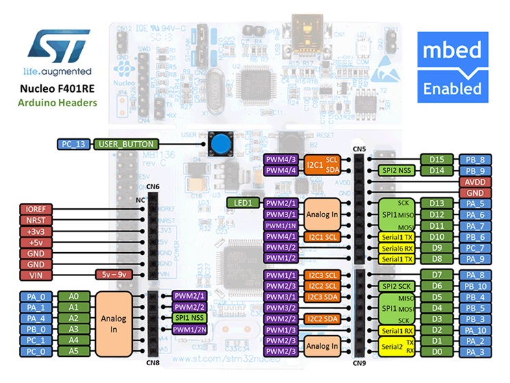
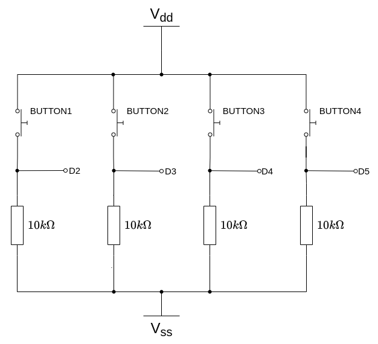
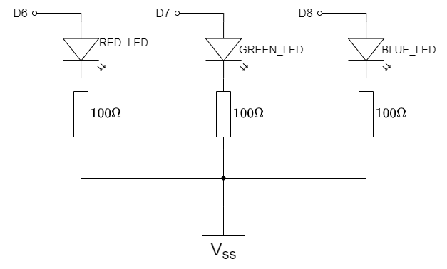

Rapid Embedded Systems - Design and Programming Course - Rev 1.0

[Table of Contents](/README.md#syllabus)

---


---

# Module 6 - Interrupts

## Lecture Slides

The lecture slides relevant to this section are listed below. It is suggested you follow these first before attempting the lab materials.

| Lecture | Description |
| - | - |
| 6 | [Interrupts](./Module_6.pptx) |
| |

If you clone this repository, lecture slides are available in PowerPoint format in the folder `Materials/Module_6`

# 1 Introduction

## 1.1 Lab Overview
In this lab, we will implement two functions. For the first function, the RGB LEDs are controlled by the status of the buttons. For the second, the number of times each button has been pressed controls the LEDs. By the end of this lab you will get some insight and practical experience with the Mbed API for Interrupts.

# 2 Requirements

## 2.1	Software and Hardware

In this lab, we will be using the following software and hardware: 

* SOFTWARE - one of the following:

   * **Mbed Studio**, an IDE designed to streamline development and prototyping using Mbed enabled microcontrollers and development boards: https://os.mbed.com/studio/
    
   * **Mbed online compiler**, which can be found here: https://ide.mbed.com/compiler

* **NUCLEO-F401RE**, or another suitable Mbed OS 6 compatible development board. A full list of compatible devices can be found here: https://os.mbed.com/platforms, note that outputs may have to be reconfigured for devices following a different standard.

* A breadboard, 4 x 330Ω resistors, 4 x buttons, 1 red LED, 1 blue LED, 1 green LED.

Two code skeletons, which includes some support for implementing the task in section [5.1](#51) and [5.2](), should be found in the same folder as this manual.

# 3 Hardware Setup

## 3.1 Pin Layout

In this experiment, we are going to use the Nucleo F401RE board. The pin descriptions for the board can be found below:

<figure>

<figcaption>Figure 1: The NUCLEO F401RE board pin descriptions</figcaption>
</figure>

On 2 breadboards, build the circuits in Figure 2, using the hardware components listed in 2. [“2. Requirements”](#2-Requirements):

<figure>


<figcaption>Figure 2: (Upper) Buttons Pulling GPIO inputs HIGH; (Lower) LED Outputs</figcaption>
</figure>

On a breadboard, connect all four buttons according to the diagram on the left.  For the purpose of this lab, your buttons should pull the GPIO pin HIGH. Then connect the buttons and the LED to their respective pin on the board as defined in the table below.

| Pin | Pin name in Mbed API |
| - | - |
| `BUTTON 1` | D2 |
| `BUTTON 2` | D3 |
| `BUTTON 3` | D4 |
| `BUTTON 4` | D5 |
| `RED LED` | D6 |
| `GREEN LED` | D7 |
| `BLUE LED` | D8 |
| - | - |

| TASK 6-3-1 | Hardware Test |
| - | - |
| 1. | Set `module6-3-1-hwtest` as the active project |
| 2. | Build and run |
| 3. | Check all the LEDs are lighting up |
| 4. | Press each button in turn and check the output in the serial monitor |

Note from figure 2 that the switches are configured as PULL-UP. 

* With the switch open, the 10k&Omega; resistor will pull the level down to 0V (LOW). Almost no current flows out of the microcontroller pin.
* Pressing a switch will pull the respective input to 3.3V (HIGH), and conduct 0.1mA of current to ground via the resistor.

If the hardware is not working, proceed no further and check the wiring carefully.

# 4 Software Interfaces

## 4.1 InterruptIn in C

The InterruptIn interface is used to trigger an event when a digital input pin (GPIO) changes. 

| Task 4.1 | InterruptIn |
| - | - |
| 1. | Set task-4-1 as your active project. Build and run |
| 2. | Press and release each of the buttons |
| - | Observe the console output and LED states |

Let's now look at some key points in this code. First, we declare 4 instances of `InterruptIn`.

```C++
InterruptIn button1(D2);
InterruptIn button2(D3);
InterruptIn button3(D4);
InterruptIn button4(D5);
```

 This is similar to `DigitalIn` except we can now enable interrupts as follows:

 ```C++
button1.rise(&button1ISR);
button2.rise(&button2ISR);
button3.fall(&button3ISR);
button4.fall(&button4ISR);
  ```

Not that the only parameter is the address of a function (otherwise known as a **function pointer**). This function takes no parameters and returns nothing. This function is known as an **Interrupt Service Routine (ISR)**

One of these is shown below:

```C++
void button1ISR() {
    ledRed = !ledRed;
}
```

Note also how a particular type of event triggers an interrupt. For `InterruptIn`, this is either a rising or falling edge.

There are a few key points to note about an ISR:

* They are usually kept very short and execute quickly.
* Once these functions are configured as ISRs, they are ONLY called by the hardware using the on-chip Nested Interrupt Vector Controller (NVIC). 
   * You do not normally call an ISR in your code.
* All code inside the ISR must be **interrupt safe** and **re-entrant**. Many functions (such as `printf`) do not qualify.
   * Calling functions that are not interrupt safe will result in unpredictable behaviour!


> **WARNING** *There are many hazzards when using interrupts. You should first learn about how to write them safely before considering using them*

The remaining code in main spends most of it's time in a low-power sleep state:

```C++
while (true)
{
    cout << "Going to sleep...." << endl;
    sleep();
    cout << "Awake!" << endl;
}
```

Once in the sleep state, the MCU will only wake upon an interrupt. This is a power-efficient way to write software. 

`InterruptIn` has other functions are listed below:

| Function Name | Description |
| - | - |
| `void  rise (void(*fptr)(void))` | Attach a function to call when a rising edge occurs on the input |
| `template<typename T> void rise (T *tptr, void (T : :*mptr)(void))` | Attach a member function to call when a rising edge occurs on the input |
| `void  fall (void(*fptr)(void))` | Attach a function to call when a falling edge occurs on the input |
| `template<typename T > void  fall (T *tptr, void(T::*mptr)(void))` | Attach a member function to call when a falling edge occurs on the input |
| `void mode (PinMode pull)` | Set the input pin mode |
| `void  enable_irq ()` | Enable IRQ |
| `void  disable_irq ()` | Disable IRQ |
| - | - |


## 4.2 InterruptIn and C++ (Optional)

This section is for readers who are experienced in *writing* C++ and prefer to write their code in an Object Orientated way. If you are not familiar with C++, you may want to skip this section.

`InterruptIn` is of course a C++ class, but the code in the previous section used ISRs written as C-functions. This is the simplest approach, as each function has a unique address in memory, and has access to local and global state, such as variables and IO.

With C++, the situation gets a bit more complex (and is a source of confusion) due to the way class member functions are called.

> Identical C++ class member functions are shared across all instances of a class, and there is only one copy of the function code. *However*, each instance has exclusive access to it's member variables via the *this* pointer.
>
>> Therefore, each instance of a class (object) shares the same identical member function code. This makes sense as the code is read-only.
>
>> Conversely, each instance of a class (object) contains it's own independent set of member variables. 
>
> When you invoke a member function on an object (instance of a class), it needs to know where it's member variables are in memory. Under the hood, the address for each object is passed as a hidden parameter, which becomes the *this* pointer.

Therefore, to use a member function as an ISR, we need two pieces of information:

* Address of the function (which has access to member variables)
* The *this* pointer (so it can locate the member variables)

Let's look at an example to illustrate how this is achieved:

| Task 4.2 | InterruptIn in C++ |
| - | - |
| 1. | Set task-4-2 as your active project. Build and run |
| 2. | Note how it performs the same as the previous task |
| 3. | Look closely at the constructor of the `ButtonFlash` class |
| - | The initialiser list ensure the members are initialised correctly BEFORE the constructor runs |
| - | The constructor initialises the interrupts |

The following would NOT work:

```C++
this->_button1.rise(&_button1ISR);
```

As explained above, all instances of the class share the same member function `_button1ISR`. This function would have no way to know the value of *this*.

Luckily, the Mbed OS framework handles this for you via the `callback` function:

```C++
this->_button1.rise(callback(this, &ButtonFlash::button1ISR));
```

To instantiate an object for this set of buttons and LEDs, the following line is used:

```C++
ButtonFlash obj(D2,D3,D4,D5, D6,D7,D8);
```

| Task 4.2 | continued... |
| - | - |
| 4. | Simplify the class to simply control one LED with one switch |
| - | The constructor only needs two pin names - one for the switch and one for the LED |
| - | Add a parameter (`bool`) to control whether a rising or falling edge should be used |
| 5. | Create 3 instances, one for each LED and test |
| - | A example solution is provided |

If you really like C++ templates, then by all means look at the sources to see how this works! For this course, it is enough to simply *use* `callback` whenever we involve C++.

## 4.3 Timer Interrupts

***[ TO BE DONE ]***

Ticker
Timeout
Debouncing

# 5 Your Application Code
In this lab task, you will use the Mbed API for Interrupts in order to complete two exercises.

## 5.1 Toggle the Lights
In the first exercise, you need to use the Mbed API functions to:
* Define an InterruptIn and ISR for each bit from input
* Setup the interrupt service routine, so that the RGB LED is used to indicate when a button is pressed.
  * Button 1: toggles RED
  * Button 2: toggles GREEN
  * Button 3: toggles BLUE
  * Button 4: lights up WHITE (RED, GREEN and BLUE)
* Put the processor into sleep mode upon exiting from the ISR
Try to issue an interrupt on different signal edges (rising edge or falling edge). What changes?

## 5.2 Counter

In the second exercise, you will need to complete the skeleton code so that it counts the number of times a button has been pressed and lights up the RGB LED, which corresponds to the button which has been pressed the most.
* Button 1 corresponds to the Red LED
* Button 2 corresponds to the Green LED
* Button 3 corresponds to the Blue LED
* Button 4 is used to reset all the counters and turn off all the LEDs.
Also, if several buttons have been pressed the same number of times, their respective LEDs should all be ON simultaneously.

> **If you are stuck you can look at the code solution provided with the lab for some help.**

# 6 Additional References

**Documentation for Mbed API for Interrupts**

https://os.mbed.com/docs/mbed-os/v5.13/apis/interruptin.html#related-content 


[Table of Contents](/README.md#syllabus)

Copyright © 2021 Arm Limited (or its affiliates). All rights reserved. 