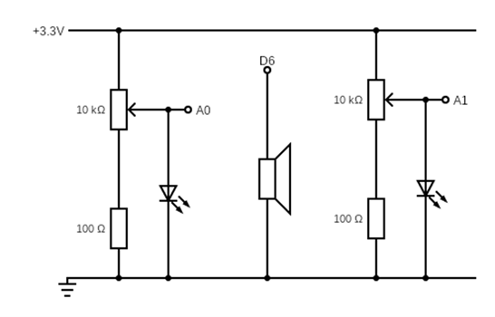

Rapid Embedded Systems - Design and Programming Course - Rev 1.1

[Table of Contents](/README.md#syllabus)

---


---

# Module 7 - Analog Input and Output

## Lecture Slides

The lecture slides relevant to this section are listed below. It is suggested you follow these first before attempting the lab materials.

| Lecture | Description |
| - | - |
| 7 | [Analog Input and Output](./Module_7.pptx) |
| |

If you clone this repository, lecture slides are available in PowerPoint format in the folder `Materials/Module_7`

# 1 Introduction

In this lab, we will implement an audio wave generator using PWM. We will set it up so that the volume and the pitch can be tuned using potentiometers.

By the end of this lab you will get some insight and practical experience with the Mbed API for Analog I/O and PWM. 

# 2 Requirements
In this lab, we will be using the following software and hardware: 

* SOFTWARE - one of the following:

   * Mbed Studio, an IDE designed to streamline development and prototyping using Mbed enabled microcontrollers and development boards: https://os.mbed.com/studio/

   * Mbed online compiler, which can be found here: https://ide.mbed.com/compiler


* NUCLEO-F401RE, or another suitable Mbed OS 6 compatible development board. A full list of compatible devices can be found here: https://os.mbed.com/platforms, note that outputs may have to be reconfigured for devices following a different standard.

* A breadboard, 2 x 100Ω resistors, 2 x 10kΩ potentiometers, 1 x speaker (ABI-001-RC), 2 x LED.

The code skeleton, which includes some support for implementing the task in [section 5.2]() should be found in the same folder as this manual.

# 3 Hardware Setup

## 3.1 Pin Layout

In this experiment, we are going to use the Nucleo F401RE board. The pin descriptions for the board can be found below:

<figure>

<figcaption>Figure 1: The NUCLEO F401RE board pin descriptions</figcaption>
</figure>

On a breadboard, build the circuit in Figure 2, using the hardware components listed in section [“2. Requirements”](#2-Requirements):

<figure>

<figcaption>Figure 2: Circuit Layout</figcaption>
</figure>

Pins on the board are as defined in the table below:

| Pin | Pin name in Mbed API |
| - | - |
| Potentiometer 1 | A0 |
| Potentiometer 2 | A1 |
| PWM speaker | D6 |
| - |

# 4	Technical background

## 4.1 PwmOut Interface

Pulse width modulation (PWM) is a simple method of using a rectangular digital waveform to create an analog output. PWM uses the width of the pulse to represent an amplitude.

The period of the wave is usually kept constant, and the pulse width, or ON time is varied.

The duty cycle is the proportion of time that the pulse is ON or HIGH, and is expressed as a percentage:

Duty cycle = 100% * (pulse ON time)/(pulse period)

Whatever duty cycle a PWM stream has, there is an average value. If the ON time is small, the average value is low; if the ON time is large, the average value is high. Therefore, by controlling the duty cycle, we control the average output value (represented as the red line below).

<figure>

<figcaption>Figure 3: PWM</figcaption>
</figure>

We can use the PwmOut interface to control the frequency and duty cycle of a PWM signal. Here are some examples showing how:

```C++
PwmOut led(D5);		//define the PWM output
led = 0.5;			//set the duty cycle of PWM output to 50%
led.period(0.02)		//set the output frequency to 50Hz ; 
```

The PwmOut interface has a set of member functions which can be found in figure 3:

| Function name	| Description |
| - | - |
| `void write (float value)` | Set the output duty-cycle, specified as a percentage (float) |
| `float read ()` | Return the current output duty-cycle setting, measured as a percentage (float) |
| `void period (float seconds)`	| Set the PWM period, specified in seconds (float), keeping the duty cycle the same |
| `void period_ms (int ms)` | Set the PWM period, specified in milli-seconds (int), keeping the duty cycle the same |
| `void period_us (int us)`	| Set the PWM period, specified in micro-seconds (int), keeping the duty cycle the same |
| `void pulsewidth (float seconds)` | Set the PWM pulse width, specified in seconds (float), keeping the period the same |
| - |

*Figure 3: Member function of PwmOut API*

> **Note** that not all the Digital pins can be used as PWM outputs.

## 4.2 Wave Generation

We can use for loops to generate simple waveforms without using lookup tables. For example, for a saw-tooth wave we could use:

```C++
for(i=0; i<1; i+=0.05)
	out = i;
```

or, for a triangle wave use two for loops:

```C++
for(i=0; i<1; i+=0.05)
	out = i;
for(i=1; i>0; i-=0.025)
	out = i;
```

### 4.3 Analog I/O Interfaces

The AnalogIn interface is used to read an external voltage applied to an analog input pin. AnalogIn() reads the voltage as a fraction of the system voltage. The value is a floating point from 0.0(VSS) to 1.0(VCC). For example, we can test the voltage on the initialized analog pin and compare it to a threshold voltage.

```C++
AnalogIn   ain(A0);
DigitalOut dout(LED1);

int main(void)
{
    while (1) {
        if(ain > 0.3f) {
            dout = 1;
        } else {
            dout = 0;
        }
        wait(0.2f);
    }
}
```

AnalogIn Interface has a set of member functions which can be found in figure 4:

| Function name	| Description |
| - | - |
| `float read()` | Read the input voltage, represented as a float in the range [0.0, 1.0] |
| `unsigned short read_u16()` | Read the input voltage, represented as an unsigned short in the range [0x0, 0xFFFF] |
| `operator float()` | An operator shorthand for `read()` | 

Similarly, we use `AnalogOut` interface to set the output voltage of an analog output pin specified as a percentage or as an unsigned short. It can be used to generate waveforms, for example, for outputting a saw-tooth waveform:

```C++
AnalogOut  aout(A5);
DigitalOut dout(LED1);

int main(void)
{
    while (1) {
        for (float i = 0.0f; i < 1.0f; i += 0.1f) {
            aout = i;
            wait(1.0f);
        }
    }
}
```

# 5	Generating audio waves using PWM

In this lab, you will have to use the PWM output to generate electrical waves which can be turned into sound by the on-board speaker. Be aware that the frequency of the wave must be in a specific range so that humans can hear it.

## 5.1 Audio waves

A sound is essentially an air wave. The amplitude and the frequency of the wave decide the volume and the pitch of the sound respectively. The speaker (or headphone) inputs electrical signals (voltages) and use them to turn a coil into an electromagnet, which can either attract or repel the magnet that moves back and forth. The motion of the magnet will further push and pull a diaphragm and create air waves (just like a drum).

## 5.2 Your application code

In this lab exercise you will need to:

* Define analog input, PWM and serial output ports
   * Two analog inputs for two potentiometers 
   * One PWM output for the speaker
* Generate waves to the PWM output
   * Generate a saw-tooth wave (design the range to be from 320Hz to 8kHz)
   * Use potentiometer 1 to tune the pitch and the potentiometer 2 adjust the volume.
* Test the code, use the LEDs to track both input voltages.

What changes when you adjust the amount by which variable *i* is incremented/decremented?

% 6 Additional references

**Documentation for AnalogIn API**

https://os.mbed.com/docs/mbed-os/v5.13/apis/analogin.html

**Documentation for PwmOut API**

https://os.mbed.com/docs/mbed-os/v5.13/apis/pwmout.html

**Audio frequencies**

http://en.wikipedia.org/wiki/Audio_frequency


---

[Table of Contents](/README.md#syllabus)

Copyright © 2021 Arm Limited (or its affiliates). All rights reserved. 