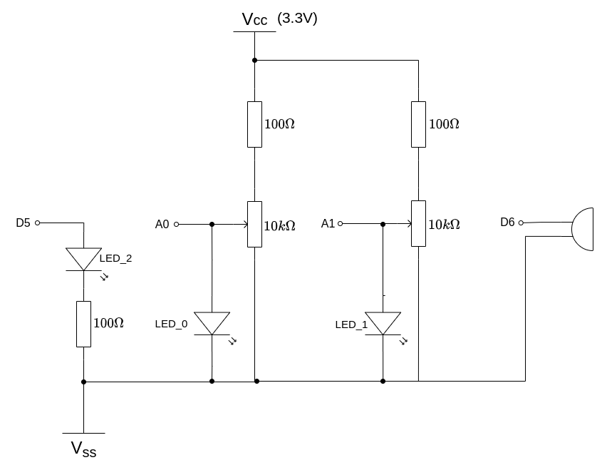
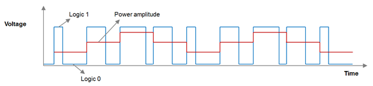

Rapid Embedded Systems - Design and Programming Course - Rev 1.1

[Table of Contents](/README.md#syllabus)

---


---

# Module 7 - Analog Input and Output

## Lecture Slides

The lecture slides relevant to this section are listed below. It is suggested you follow these first before attempting the lab materials.

| Lecture | Description |
| - | - |
| 7 | [Analog Input and Output](./Module_7.pptx) |
| |

If you clone this repository, lecture slides are available in PowerPoint format in the folder `Materials/Module_7`

# 1 Introduction

In this lab, we will implement an audio wave generator using PWM. We will set it up so that the volume and the pitch can be tuned using potentiometers.

By the end of this lab you will get some insight and practical experience with the Mbed API for Analog I/O and PWM. 

# 2 Requirements
In this lab, we will be using the following software and hardware: 

* SOFTWARE - one of the following:

   * Mbed Studio, an IDE designed to streamline development and prototyping using Mbed enabled microcontrollers and development boards: https://os.mbed.com/studio/

   * Mbed online compiler, which can be found here: https://ide.mbed.com/compiler


* NUCLEO-F401RE, or another suitable Mbed OS 6 compatible development board. A full list of compatible devices can be found here: https://os.mbed.com/platforms, note that outputs may have to be reconfigured for devices following a different standard.

* A breadboard, 2 x 100Ω resistors, 2 x 10kΩ potentiometers, 1 x speaker (ABI-001-RC), 2 x LED.

The code skeleton, which includes some support for implementing the task in [section 5.2](#52-Your-Application-Code) should be found in the same folder as this manual.

# 3 Hardware Setup

## 3.1 Pin Layout

In this experiment, we are going to use the Nucleo F401RE board. The pin descriptions for the board can be found below:

<figure>

<figcaption>Figure 1: The NUCLEO F401RE board pin descriptions</figcaption>
</figure>

On a breadboard, build the circuit in Figure 2, using the hardware components listed in section [“2. Requirements”](#2-Requirements):

<figure>

<figcaption>Figure 2: Circuit Layout</figcaption>
</figure>


Pins on the board are as defined in the table below:

| Pin | Pin name in Mbed API |
| - | - |
| LED | D5 |
| Potentiometer 1 | A0 |
| Potentiometer 2 | A1 |
| PWM Buzzer | D6 |
| |

We will use this schematic for all tasks in this lab.

# 4	Technical background

## 4.1 PwmOut Interface

Pulse width modulation (PWM) is a simple method of using a rectangular digital waveform to create an analog output. PWM uses the width of the pulse to represent an amplitude.

The period of the wave is usually kept constant, and the pulse width, or ON time is varied.

The duty cycle is the proportion of time that the pulse is ON or HIGH, and is expressed as a percentage:

Duty cycle = 100% * (pulse ON time)/(pulse period)

Whatever duty cycle a PWM stream has, there is an average value. If the ON time is small, the average value is low; if the ON time is large, the average value is high. Therefore, by controlling the duty cycle, we control the average output value (represented as the red line below).

<figure>

<figcaption>Figure 3: PWM</figcaption>
</figure>

We can use the PwmOut interface to control the frequency and duty cycle of a PWM signal. 

| Task: 7-4-1 | PwmOut |
| - | - |
| 1. | Open, build and run Task module7-4-1-PWM_Interface |
| 2. | Note the brightness of the red LED |
| 3. | Now set the duty cycle to 0.9f. Run and compare |
| - | Observe the evidence that more power is being delivered to the LED |
| 4. | Set the duty cycle to 0.5f and the period to 0.1f. |
| - | When you run this, you will notice the flickering |

Let's look at the code:

```C++
#include "mbed.h"

PwmOut led1(D5);        //Define the PWM output using a PWM compatible pin

int main()
{
    led1.period(0.02f);  //Define the PWM period (20ms, 50Hz)
    led1 = 0.1f;         //Set the duty cycle to 10%

    while (true)
    {
        sleep();
    }
}
```

**Notes**

* We set the duty cycle using the `=` operator. This uses C++ operator overloading to call `led1.write(0.1f)`

* The period needs to be fast enough so the human eye does not perceive any flickering. For other devices, such as DC motors, we need to be careful not to set the period to high.

* The CPU was able to enter a low-power sleep mode while the PWM continued. The PWM circuitry can run independently from the CPU.

* Not all the Digital pins can be used as PWM outputs. Check the documentation of your board if different.

The `PwmOut` interface has a set of member functions some of which are listed in figure 3:

| Function name	| Description |
| - | - |
| `void write (float value)` | Set the output duty-cycle, specified as a percentage (float) |
| `float read ()` | Return the current output duty-cycle setting, measured as a percentage (float) |
| `void period (float seconds)`	| Set the PWM period, specified in seconds (float), keeping the duty cycle the same |
| `void period_ms (int ms)` | Set the PWM period, specified in milli-seconds (int), keeping the duty cycle the same |
| `void period_us (int us)`	| Set the PWM period, specified in micro-seconds (int), keeping the duty cycle the same |
| `void pulsewidth (float seconds)` | Set the PWM pulse width, specified in seconds (float), keeping the period the same |
| |

*Figure 3: Member function of PwmOut API*


> If you want to explore the APIs yourself, a useful place to look is the class header file. In the editor, right click `PwmOut` and select `Go to definition`. This should take you to `PwmOut.h` where you can see all the APIs available to you.

## 4.2 Wave Generation

We can use for loops to generate simple waveforms without using lookup tables. For example, for a saw-tooth wave we could use:

```C++
#include "mbed.h"

PwmOut led1(D5);        //Define the PWM output using a PWM compatible pin

int main()
{
    led1.period_us(100);  //Define the PWM period (100us)

    while (true) {
        for (uint32_t i=0; i<100; i++) {    //
            led1.pulsewidth_us(i);          // Pulse width ranges from 0..100us
            wait_us(10000);                 // 10ms*100 = 1s per cycle
        }
    }
}
```

| Task: 7-4-2 | Wave Generation |
| - | - |
| 1. | Open, build and run Task module7-4-2-WaveGeneration |
| 2. | Modify the code to produce a triangle wave  |
| - | (The LED smoothly brightens then dims)
| - | A solution is provided |

In this example, the `pulsewidth_us(int)`is used so that we can control the precision and resolution.

## 4.3 Analog I/O Interfaces
Microcontrollers are often used to interface to the analog world. There are two core principles:

* **Analog to Digital Conversion** whereby an external voltage is converted to an `N`-bit integer representation. This is performed by an Analog to Digital Converter (**ADC**).
* **Digital to Analog Conversion** whereby an `N`-bit integer is converted to an external voltage. This is performed by a Digital to Analog Converter (**DAC**).

In both cases, the following is true:

* The larger the value of `N`, the higher the resolution and lower the *quantisation error* 
* The integer representation and the voltage value should be linearly related. The ideal is that if you plot one against the other, you would get a straight line.

The resolution `N` and  the linearity are both important properties.

### 4.3.1 Analog to Digital Conversion (ADC)

The `AnalogIn` interface is used to read an external voltage applied to an analog input pin. `AnalogIn` allows us to read the voltage either as an unsigned integer or scaled as a fraction of the system voltage, that is, a floating point value from 0.0(VSS) to 1.0(VCC). 

For example, we can test the voltage on the initialized analog pin and compare it to a threshold voltage.

```C++
AnalogIn   ain(A0);
DigitalOut led_2(D5);

int main(void) {
    while (1) {
        float v = ain;  //Read ADC
        if(v > 0.3f) {  // is the voltage greater than 0.3 * VCC?
            led_2 = 1;   //Turn on LED_2
        } else {
            led_2 = 0;   //Turn off LED_2
        }
        wait_us(200000); // 200ms delay
    }
}
```

| Task 4-3 | `AnalogIn` |
| - | - |
| 1. | Open, build and run the project module7-4-3-AnalogIn |
| 2. | Rotate the potentiometer connected to pin `A0`. You will notice the brightness of `LED_0` change |
| - | Note the state of `LED_2` |
| 3. | Can you find potentiometer position where `LED_2` flashes on and off erratically? (it might be tricky) |

> As a side note, applying hard-thresholds to analog signals in this way can be problematic. All analog signals will have some random noise superimposed on them.

The `AnalogIn` interface has a set of member functions which can be found in figure 4:

| Function name	| Description |
| - | - |
| `float read()` | Read the input voltage, represented as a float in the range [0.0, 1.0] |
| `unsigned short read_u16()` | Read the input voltage, represented as an unsigned short in the range [0x0, 0xFFFF] |
| `operator float()` | An operator shorthand for `read()` | 

*Figure 4: Member functions of AnalogIn API*

Again, right-click on `AnalogIn` in mbed studio, and click "Go to Definition" to see the header file.

| Task 4-3 | Continued |
| - | - |
| 4. | Modify the code to use `read_u16()`. |
| - | You may wish to refer to the documentation to fully understand `read_u16()` first |
| - | A solution is provided |

### 4.3.2 Digital to Analog Conversion

Some microcontrollers have an on-chip Digital-to-Analog Converter (DAC), which is used to convert an integer representation of a voltage to a physical voltage on a supporting pin. The board used in this course does not have a DAC.

Similar to `AnalogIn`, we use `AnalogOut` interface to set the output voltage of an analog output pin specified as a percentage or as an unsigned short. It can be used to generate waveforms, for example, for outputting a saw-tooth waveform:

```C++
AnalogOut  aout(A5);
DigitalOut dout(LED1);

int main(void)
{
    while (1) {
        for (float i = 0.0f; i < 1.0f; i += 0.1f) {
            aout = i;
            wait_us(100000);
        }
    }
}
```

The reader is encouraged to read the documentation on the `AnalogOut` class in mbed-os.


# 5	Generating audio waves using PWM

In this lab, you will have to use the PWM output to generate electrical waves which can be turned into sound by the on-board speaker. Be aware that the frequency of the wave must be in a specific range so that humans can hear it.

## 5.1 Audio waves

A sound is essentially an air wave. The amplitude and the frequency of the wave decide the volume and the pitch of the sound respectively. The speaker (or headphone) inputs electrical signals (voltages) and use them to turn a coil into an electromagnet, which can either attract or repel the magnet that moves back and forth. The motion of the magnet will further push and pull a diaphragm and create air waves (just like a drum).

## 5.2 Challenge

In this lab exercise you will need to:

* Define analog input, PWM and serial output ports
   * Two analog inputs for two potentiometers 
   * One PWM output for the speaker
* Generate waves to the PWM output
   * Generate a saw-tooth wave (design the range to be from 320Hz to 8kHz)
   * Use potentiometer 1 to tune the pitch and the potentiometer 2 adjust the volume.
* Test the code, use the LEDs to track both input voltages.

What changes when you adjust the amount by which variable *i* is incremented/decremented?


# 6 Additional references

**Documentation for AnalogIn API**

https://os.mbed.com/docs/mbed-os/v5.13/apis/analogin.html

**Documentation for PwmOut API**

https://os.mbed.com/docs/mbed-os/v5.13/apis/pwmout.html

**Audio frequencies**

http://en.wikipedia.org/wiki/Audio_frequency


---

[Table of Contents](/README.md#syllabus)

Copyright © 2021 Arm Limited (or its affiliates). All rights reserved. 
