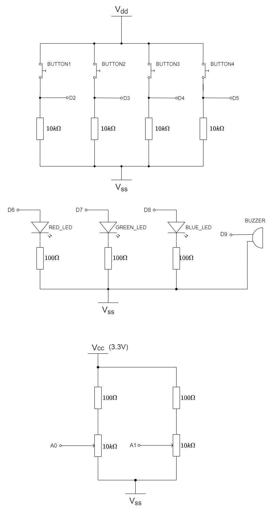

[Table of Contents](/README.md#syllabus)

---


---

# Module 8 - Timer and Pulse-Width-Modulation

## Lecture Slides

The lecture slides relevant to this section are listed below. It is suggested you follow these first before attempting the lab materials.

| Lecture | Description |
| - | - |
| 8 | [Timer and Pulse-Width-Modulation](./Module_8.pptx) |
| |

If you clone this repository, lecture slides are available in PowerPoint format in the folder `Materials/Module_8`

# 1 Introduction

# 1.1	Lab overview
We have already met Timers in previous module 6 (Interrupts). Hardware timers underpin the `Ticker` and `Timeout` types as well are RTOS scheduling (see module 10). Hardware timers are also used with sequential code, and this is what we are going to look at here.

`PwmOut` was also used back in module 7 as a way to generate a mean DC output. This is also underpinned by hardware timers.

In this lab, we will design an audio player that will play a melody saved beforehand. The volume of the music as well as its speed can be controlled by two buttons. By the end of this lab you will get some insight and practical experience with the Mbed API for Timers and Tickers.

# 2	Software Setup

In this lab, we will be using the following software and hardware:

- **Mbed Studio**, an IDE designed to streamline development and prototyping using Mbed enabled microcontrollers and development boards: https://os.mbed.com/studio/

    **OR**

    **Keil Studio**, which can be found here: https://studio.keil.arm.com/auth/login/
  

- **NUCLEO-F401RE**, or another suitable Mbed OS 6 compatible development board. A full list of compatible devices can be found here: https://os.mbed.com/platforms, note that outputs may have to be reconfigured for devices following a different standard.

# 3 Hardware Setup

In this experiment, we are going to use the Nucleo F401RE board. The pin descriptions for the board can be found below:

<figure>

<figcaption>Figure 1: The NUCLEO F401RE board pin descriptions</figcaption>
</figure>

On 2 breadboards, build the circuits in Figure 2, using the hardware components listed in 2. [“2. Requirements”](#2-Requirements):

<figure>

<figcaption>Figure 2: (Upper) Buttons Pulling GPIO inputs; (Lower) LED and Buzzer Outputs</figcaption>
</figure>

On a breadboard, connect all four buttons according to the diagram on the left.  For the purpose of this lab, your buttons should pull the GPIO pin HIGH. Then connect the buttons and the LED to their respective pin on the board as defined in the table below.

| Pin | Pin name in Mbed API |
| - | - |
| `BUTTON 1` | D2 |
| `BUTTON 2` | D3 |
| `BUTTON 3` | D4 |
| `BUTTON 4` | D5 |
| `RED LED` | D6 |
| `GREEN LED` | D7 |
| `BLUE LED` | D8 |
| `BUZZER` | D9 |
| - | - |

# 4 Timer Interfaces

## 4.1 Timer Interface
We can use the timer interface to create, start, stop and read a timer for measuring precise times (better than millisecond precision), for example:

```C++
Timer tmr;
 
int main() {
    tmr.start();
    printf("Hello World!\n");
    long long t = tmr.elapsed_time().count();
    printf("The time taken was %Ld uSeconds\n", t); 
}
```

You can independently create, start and stop any number of Timer objects simultaneously. The member functions of the API can be found in [section 4.4](#44-software-functions).

| Task 4-1 | Timer |
| - | - |
| 1. | Make `module8-4-1-Timer` the active project. Build and run |
| 2. | Read the code comments and answer the following questions (Hover your mouse over the following questions to reveal the answers) |
| a | <p title="Approximately 2.5%">What percentage of the time is the red LED on?</p> |
| b | <p title="Approximately 50%">What percentage of the time is the green LED on?</p> |
| c | <p title="No. If it is already running, it will reset to zero and keep running.">If you reset a timer with `reset()`, do you need to restart it again?</p> |
| d | <p title="std::chrono::microseconds which (under the hood) is represented as a `long long`">When you read a timer (without blocking) using the `elapsed_time()` function, what is the data type of the returned value?</p> | 

### 4.1.1 The `std::chrono::microseconds` type

If you are not familiar with the `C++` type `std::chrono::microseconds`, the last question might confuse you, as might the suffixes `ms` and `us`.

Timing is such a fundamental task of embedded systems. When interfacing with external devices and signals, we often work in units of seconds, milliseconds (ms) and microseconds (us). Scaling values between these units is error prone and hard to read. This is where `chrono` comes in.

`std::chrono` is a **namespace**.  This is simply a C++ a prefix to prevent name collisions.

* Under the hood, anything of type `std::chrono::seconds`, `std::chrono::milliseconds` or `std::chrono::microseconds` is really a variable of type `long long`
* The basic resolution is 1 microsecond
* A literal value with the suffix `ms` will be scaled by 1000
* A literal value with the suffix `s` will be scaled by 1000000

So the following are actually the exact same value:

`1s`, `1000ms`, `1000000us`

Perform a type-cast, you each will give you the value of 1000000.

(long long)1s will return `1000000`

This means that literal values in our code that represent timings can be written with natural units. They may be values taken from a data sheet for example. Remember that all the values are scaled to microseconds.

How does this work? C++ operator overloading. Here is an example that converts angles to radians:

```C++
constexpr long double operator"" degrees(long double deg)
{
    long double radians = deg * 3.1415926 / 180.0;
    return radians;
}
```
### 4.1.3 Relationship to the Hardware

Microcontrollers based on the Arm Cortex M4.....

## 4.2 Ticker and Timeout Interfaces

`Timer` does not abstract interrupts. It is only used for polling.

As we learned in module 6, we can use the `Ticker` interface to set up a recurring interrupt that calls a function (ISR) repeatedly at a specified rate. We also have `Timeout` which calls a function once after a specified duration.

We can see examples of this below:

```C++
#include "mbed.h"

Ticker t1;
Ticker t2;
Timeout oneShot;

DigitalOut led1(D6);
DigitalOut led2(D7);
DigitalOut led3(D8);
 
void flip1() {
    led1 = !led1;
}

void flip2() {
    led2 = !led2;
}
 
int main() {
    // Passing a function pointer
    t1.attach(&flip1, 500ms); 
    t2.attach(&flip2, 700ms);

    //Using a C++ lambda function
    oneShot.attach( []() { led3 = 1; }, 5s);

    // Sleep in the main loop
    while(1) {
        sleep();
        printf("I'm awake\n\r");
    }
}
```

Note that for the ticker, we used a C++ lambda function. If you are not familiar with lambda function, it is a way to write the function code inline. This helps to keep the code all in one place.

| Task 4-2 | `TickerTimeout` |
| - | - |
| 1. | Set module8-4-2-TickerTimeout as the active project. Build and run. |
| 2. | Comment out or delete functions `flip1()` and `flip2()`, and perform the led flashing in a lamda function |
 

You can create any number of Ticker objects, allowing multiple outstanding interrupts at the same time. The function can be a static function, a member function of a particular object or a Callback object. This can be done using the member functions of this API which can be found in [section 4.3](#43-Software-Functions).

# 4.3 PWM

We met the PWM earlier in the course. In this section, we look at how to generate musical notes using a PWM.

* The period of the PWM controls the fundamental frequency (musical tone)
* The duty controls the volume

| Task 4-3 | PWM |
| - | - |
| 1. | Make module8-4-3-PWM the active project. Build and run |
| - | Press the blue button to start |
| - | Try changing the volume using buttons 1 and 2 |
| - | Try changing the pitch with buttons 3 and 4 |
| 2. | Challenge - this example uses polling to read the buttons. Can you change this to interrupts to save power? |
| - | A solution is provided |

The buzzer can become quite annoying after a while (which is why it does not play immediately). Press the black reset button to silence the buzzer.

# 4.4 Software functions

You can find in the table below the member function of the Timer Interface and Ticker interface which were introduced in this lab, as well as some member function of the PwmOut Interface which will be helpful for this lab.

| Function Name | Description |
| - | - |
| **Timer Functions** |
| `void start ()` | Start the timer |
| `void stop ()` | Stop the timer |
| `void reset ()` | Reset the timer to 0 |
| `float read ()` | Get the time passed in seconds |
| `int read_ms ()` | Get the time passed in milliseconds |
| `int read_us ()` | Get the time passed in microseconds |
| |
| **Time Ticker functions** |
| `void attach (void(*fptr)(void), float t)` | Attach a function to be called by the Ticker, specifying the interval in seconds |
| `void attach (T *tptr, void(T::*mptr)(void), float t)` | Attach a member function to be called by the Ticker, specifying the interval in seconds |
| `void attach_us (void(*fptr) (void), unsigned int t)` | Attach a function to be called by the Ticker, specifying the interval in micro-seconds |
| `void attach_us (T *tptr, void (T::*mptr) (void), unsigned int t)` | Attach a member function to be called by the Ticker, specifying the interval in micro-seconds |
| `void detach ()` | Detach the function. |
| `static void irq (uint32_t id)` | The handler registered with the underlying timer interrupt. |
| |
| **PWM output functions** |
| `void write (float value)` | Set the output duty-cycle, specified as a percentage (float) |
| `float read ()` | Return the current output duty-cycle setting, measured as a percentage (float) |
| `void period (float seconds)` | Set the PWM period, specified in seconds (float), keeping the duty cycle the same |
| `void period_ms (int ms)` | Set the PWM period, specified in milli-seconds (int), keeping the duty cycle the same |
| `void period_us (int us)` | Set the PWM period, specified in micro-seconds (int), keeping the duty cycle the same |
| `void pulsewidth (float seconds)` | Set the PWM pulse width, specified in seconds (float), keeping the period the same |
| `void pulsewidth_ms (int ms)` | Set the PWM pulse width, specified in milli-seconds (int), keeping the period the same |
| `void pulsewidth_us (int us)` | Set the PWM pulse width, specified in micro-seconds (int), keeping the period the same |
| `PwmOut & operator= (float value)` | An operator shorthand for write () |
| `PwmOut & operator float ()` | An operator shorthand for read () |

# 5 Designing an Audio Player

In this lab task, you will design an audio player that uses a timer, PWM, and interrupts.

## 5.1 Define the Music Note and Beat Length
To play music, it is better to define a list of notes that maybe used to play the music, including the music notes (the frequency of the sound, e.g. do, re, mi, fa, so, la, si) and the beat length (the time that the current note lasts for, such as whole note, half note). To do that, you need to:

* Set the **period** of the PWM so that it can produce a correct frequency for each music note
* Wait for a defined period to obtain the correct note duration.

After defining the music note and beat length, you can then make a note array which will produce a simple piece of music, for example the following sheet gives the notes and beats of “Jingle bells”

Some starter code has been provided.

| Task 5-1 | JingleBells |
| - | - |
| 1. | Make module8-5-1-JingleBells your active project. |
| 2. | Build and run. Press the blue button to start playback |

This is a basic application that you are going to improve. 

You may note some key points:

* The frequency of each note is pre-calculated in the function `void preCalculateNotes()`
* Some `C` Macros are provided to calculate the frequency of the notes in the key of C-Major. The value of octave is limited to 1 in this exercise, but would be 2 to move up and octave, and 0.5 to drop down.

For those who are musical, the score is shown below. If you do not read music, it does not matter. All notes and durations are already pre-created for you. Your task should focus around software.

<figure>

<figcaption>Figure 3: jingle bells 4 bar</figcaption>
</figure>

<figure>

<figcaption>Figure 4: jingle bells 4 bar 2</figcaption>
</figure>


# 5.2 Challenge

This challenge builds on what you have learned in previous sections as well as this one. Starting with the demonstration code in 5.1, your challenge is to make some changes and additions to improve this music player. Key to this is power saving as the intention is that this will be powered by a coin cell, and needs a shelf life of many months.

| Task 5-2 | Requirements |
| - | - |
| 1. | The software shall not use spinning waits (such as `wait_us`). Instead interrupts should be used to minimise power consumption. |
| 2. | A potentiometer shall be used to set the speed of the playback. Note that AnalogIn is NOT interrupt safe |
| *hint* | You can access `AnalogIn` in main when the CPU comes out of sleep. Use a `Ticker` to wake the CPU periodically to sample the analog input |
| 3. | Use two buttons to control the volume. Use interrupts to keep power consumption low. See the function `float calcVolume(uint16_t vol)` in Task 4-3 as an example of controlling volume |
| 4. | Try to debounce the switches without using spinning waits. |
| *hint* | When a rising edge it detected, turn off the switch interrupt and use a `Timeout` turn it back on once the switch state has (probably) settled. Assume 250ms as a suitable delay. |
 
Watch out for race conditions. Remember that shared mutable state should be `volatile` and access protected with `CriticalSectionLock`. 

# 6 Additional references

**Documentation of Timer API**

https://os.mbed.com/docs/mbed-os/v5.13/apis/timer.html


**Documentation of Ticker API**

https://os.mbed.com/docs/mbed-os/v5.13/apis/ticker.html


**Documentation of PwmOut API**

https://os.mbed.com/docs/mbed-os/v5.13/apis/pwmout.html

[Table of Contents](/README.md#syllabus)

Copyright © 2021 Arm Limited (or its affiliates). All rights reserved. 