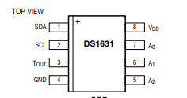

Rapid Embedded Systems - Design and Programming Course - Rev 1.0

[Table of Contents](/README.md#syllabus)

---


---

# Module 9 - Serial Communication

## Lecture Slides

The lecture slides relevant to this section are listed below. It is suggested you follow these first before attempting the lab materials.

| Lecture | Description |
| - | - |
| 9 | [Serial Communication](./Module_9.pptx) |
| |

If you clone this repository, lecture slides are available in PowerPoint format in the folder `Materials/Module_9`

# Table of Contents

[1 - Introduction](#1-introduction)

[1-1 Lab Overview](#11-lab-overview)

[2 Requirements](#2-requirements)

[2-1 Software and Hardware](#21-software-and-hardware)

[3 Hardware Setup](#3-hardware-setup)

[3-1 Pin Layout](#31-pin-layout)

[4 SPI](#4-spi)

[4-1 LCD Display and Shift Register](#41-lcd-display-and-shift-register)

[4-2 SPI API on Mbed Studio](#42-spi-api-on-mbed-studio)

[4-3 Your Application Code](#43-your-application-code)

[5 UART](#5-uart)

[5-1 Serial Interfaces in Mbed Studio](#51-serial-interface-on-mbed-studio)

[5-2 Blocking Serial](#52-blocking-serial)

[5-3 Non-blocking Serial](#53-non-blocking-serial)

[5-4 Serial Interrupts](#54-serial-interrupts)

[5-5 The default BAUD rate](#55-the-default-baud-rate)

[6 I2C](#6-i2c)

[6-1 I2C Temperature Sensor](#61-i2c-temperature-sensor)

[6-2 I2C Interface on Mbed Studio](#62-i2c-interface-on-mbed-studio)

[6-3 Challenge](#63-challenge)

[7 Additional References](#7-additional-references)

---

# 1 Introduction

## 1.1 Lab Overview
In this lab, we will display the temperature on the LCD using serial communication. We will explore how to implement different serial communication protocols : UART, SPI and I2C using their relative interface on Mbed Studio. 


# 2 Requirements

## 2.1 Software and Hardware
In this lab, we will be using the following software and hardware:

- **Mbed Studio**, an IDE designed to streamline development and prototyping using Mbed enabled microcontrollers and development boards: https://os.mbed.com/studio/

    **OR**

    **Keil Studio**, which can be found here: https://studio.keil.arm.com/auth/login/
  

- **NUCLEO-F401RE**, or another suitable Mbed OS 6 compatible development board. A full list of compatible devices can be found here: https://os.mbed.com/platforms, note that outputs may have to be reconfigured for devices following a different standard.

* A breadboard, 2 x 1kΩ resistors, 1 x temperature sensor (DS1631), 1 x LCD (NHD-0420H1Z) and 1 x shift register (74HC595N).

The code skeletons, which includes some support for implementing the task in [section 4.3](#43-Your-Application-Code), [section 5.2](#52-Your-Application-Code), [section 6.3](#63-Your-Application-Code) and [section 7](#70-Integration-using-high-level-API) should be found in the same folder as this manual

# 3 Hardware Setup

## 3.1 Pin Layout
In this experiment, we are going to use the Nucleo F401RE board. The pin descriptions for the board can be found below:

<figure>

<figcaption>Figure 1: The NUCLEO F401RE board pin descriptions</figcaption>
</figure>

On 2 breadboards, build the circuits in Figure 2, using the hardware components listed in 2. [“2. Requirements”](#2-Requirements):

<figure>


<figcaption>Figure 2: Circuit Layouts</figcaption>
</figure>

Connect the LEDs and the pins on the circuits to their relative pin which are defined in the table below. 

| Pin | Pin name in Mbed API |
| - | - |
| LCD SPI MOSI | D11 |
| LCD SPI MOSI | D13 |
| LCD SPI CS | D10 |
| Temperature sensor I2C SCL | D15 |
| Temperature sensor I2C SDA | D14 |
| USB UART TX | D1 |
| USB UART RX | D0 |
| - | - |


# 4	SPI

In this task we are going to display a string on an LCD screen using a shift register and the SPI API on Mbed studio

## 4.1 LCD display and Shift Register

The LCD (NHD-0420H1Z-FSW-GBW-33V3C) has a 4 line x 20 character display. It can be configured, and the data can be written via SPI interface. To be able to use SPI with the LCD, you will have to use a 74HC595N shift register. 
You can find out more about shift registers and the 74HC595N in Additional references section.
You will be using the LCD in 4-bit mode. Detailed initialisation procedure can be found on page 25-26 of the ST7066U LCD driver datasheet.

| Task 4-1 | LCD Display |
| - | - |
| 1. | Make module904-1-SPI_LCD the active project. Build and run |
| 2. | Press the reset button on your Nucleo board - check there are not characters on the display |
| - | Adjust the potentiometer to get the right contrast |

## 4.2 SPI API on Mbed Studio 

The SPI Interface provides a Serial Peripheral Interface Master.
You can use this interface for communication with SPI slave devices, such as FLASH memory, LCD screens and other modules or integrated circuits.
The default settings of the SPI interface are 1MHz, 8-bit, Mode 0.
You can use the SPI interface to write data words out of the SPI port, returning the data received back from the SPI slave. You can also configure the SPI clock frequency and format which can be done using the member functions of this API :

| Function Name | Description |
| - | - |
| `SPI (PinName mosi, PinName miso, PinName sclk, PinName _unused=NC)` | Create a SPI master connected to the specified pins |
| `void format (int bits, int mode=0)` | Configure the data transmission format |
| `void frequency (int hz=1000000)` | Set the spi bus clock frequency |
| `virtual int write (int value)` | Write to the SPI Slave and return the response |
| - | - |

## 4.3 Your Application Code

The aim of this task is to print text on the LCD using the shift register and the SPI API on Mbed Studio. 
In the NHD_0216HZ.cpp, implement the function init_lcd() using the initialisation sequence from the ST7066U LCD driver datasheet.
In the main.cpp file, implement some code that will print two strings over two lines on the LCD by:
* Initialising the SPI and the LCD
* Printing the first string
* Setting the cursor to a new position
* Printing the second string

If you get stuck or need help, refer to the solution code provided for this lab or go to the troubleshooting section of the document for known issues.


# 5	UART

In these lab tasks, you will exchange text between the Nucleo F401RE Board and the PC.

## 5.1 Serial Interface on Mbed Studio

The Serial interface provides UART functionality. The serial link has two unidirectional channels, one for sending and one for receiving. The link is asynchronous, and so both ends of the serial link must be configured to use the same settings.

| Interface | |
| - | - |
| [BufferedSerial](https://os.mbed.com/docs/mbed-os/latest/apis/serial-uart-apis.html) | The recommended interface for serial communication. This is the type used with the default serial IO (`putchar, printf, getchar, scanf` etc..). As the name suggests, this has buffering capability. |
| [UnbufferedSerial](https://os.mbed.com/docs/mbed-os/latest/apis/unbufferedserial.html) | This is a much more lightweight interface requiring less resources. There is no buffering, so all transactions have to be handled in real-time. This interface is well suited to using interrupts. | 

For the purpose of this section, we will use a serial terminal as a source of serial bytes, 

> We recommend you use the integrated serial terminal in Mbed Studio or Keil Studio. You can also use a third-party terminal emulator, such as [PuTTY](https://putty.org/) (PC) or [SerialTools](https://apps.apple.com/app/serialtools/id611021963?mt=12) (Mac)

### Standard IO
The `BufferedSerial` and `UnbufferedSerial` interfaces only cover APIs for serial interfacing. For standard library functions (such as `printf`), there is addition work needed to redirection I/O to a specific serial interface.

Boards designed for Mbed OS will automatically direct standard IO to a pre-configured serial interface, which are re-directed over USB back to the host computer.

The serial pins for Serial-over-usb are `USBTX` and `USBRX`

Note that in previous versions of Mbed OS, there was a [Serial](https://os.mbed.com/docs/mbed-os/v5.15/mbed-os-api-doxy/classmbed_1_1_serial.html) class that replicated standard IO. This interface was removed in Mbed OS 6 in preference to an alternative approach (see [Standard Library Functions](#55-standard-library-functions) ).

## 5.2 Blocking Serial

For this task and for illustrative purposes, we are going to use the serial-over-usb (pins `USBTX` and `USBRX`) to exchange data with the host computer.

| Task 5-2 | Blocking Serial |
| - | - |
| 1. | Make `module9-5-2` the active project. Build and run. | 
| 2. | Press 1 to turn on the buzzer and 2 to turn off the buzzer |
| 3. | Press a different key. Try also pressing the return key |
| - | <P title="In this context, pressing return is simply sending the character 13. It is no different to any other byte we might want to send. Using the return character for other purposes is a behaviour often associated with the standard library. These interfaces are just working with raw bytes.">Question: Why is it you don't need to press the return key? (hover to see the answer)</P> |
| 5. | We've added a small 250ms delay to the loop to illustrate the next point. Press lots of letter keys rapidly (but not q). Note how the character keep coming in **after** you've stopped typing. |
| - | <p title="The BufferedSerial interface utilises interrupts to capture received data and stores data in an intermediate buffer (the host computer terminal may also be buffering, but we cannot rely on that). This buys us timing slack">If we are only reading once ever 250ms, why are these character not lost?</p> Try to use the the [documentation](https://os.mbed.com/docs/mbed-os/latest/apis/serial-uart-apis.html), then hover over the above to reveal the answer. |

We've observed both the **blocking** and **buffering** behaviour of `BufferedSerial`. For a single task application, this works well. However, blocking behaviour can also be problematic. 

| Task 5-2 | ...continued |
| - | - |
| 5. | <p title="Because the CPU is blocked on the `read()` API and is ignoring the switch">Press and hold down button 1. Why does the LED not turn on?</p> |
| 6. | <p title="Pressing a key has sent a character to the serial interface of the microcontroller. This in turn has unblocked the 1-byte read() API, allowing the rest of the code to run.">While holding down button 1, type a character into the terminal. The code should unblock and the LED should light. What has happened?</p> |

Using blocking APIs is attractive as it means our code runs in-sequence, making it easy to write and comprehend (we will return to this when we talk about threads in module 10). However, blocking hardware is famously problematic when you want to interface with more than one device. One approach is to use interrupts for the other devices:

| Task 5-2 | ...continued |
| - | - |
| 6. | Using interrupts for the input switch (`InterruptIn` instead of `DigitalIn`), modify this code so that the LED can be independently switched on and off even when the CPU is blocking on the serial interface |
| - | Now open the solution |

You might observe the following lines and the end of the solution:

```C++
const char msg[] = "Button Pressed\n\r";
while (true) {
    sleep();
    serial_port.write(msg, sizeof(msg));
    //Now wait for all interrupts to clear
    wait_us(250000); //uncomment this line to see what happens!
}
```

| Task 5-2 | ...continued |
| - | - |
| 7 | Build and run, press q to quit, then press and release button 1 to show the interrupts are still enabled. |
| 8 | Now comment out the wait (as suggested in the comments). Repeat the experiment. |
| - | Note what happens |

The experiment above might have surprised you. As explained in the [documentation](https://os.mbed.com/docs/mbed-os/latest/apis/serial-uart-apis.html), `BufferedSerial` uses interrupts to send each byte of data. **There is an interrupt for each character sent**. As it is buffered, the write does not usually block, so the loop repeats and puts the MCU to sleep. However, the serial interrupts wake the MCU from sleep (9600 times a second), thus  another string is sent before the previous one was complete.

> This is another example of where we need to be careful when using interrupts. For all the benefits of interrupts, they also bring complications and risks of race conditions etc.. An alternative (albeit less efficient) is to avoid blocking entirely, and instead use a *rapid polling loop*. 

## 5.3 Non-blocking Serial

Sometimes we wish to check for serial input data, but we cannot afford to block and wait. This might include a rapid polling loop for example. Let's modify the previous example and examine this approach:

| Task 5-3 | Non-blocking Serial |
| - | - |
| 1. | Set module9-5-3-Nonblocking-Serial as the active project |
| 2. | Build and run. Note the brightness of the green LED |
| 3. | Press the blue button to start the polling loop |
| 4. | <p title="The green LED is now switching on and off very rapidly as the loop iterates. This is a similar effect to PWM that we saw in an earlier exercise">Why does the green LED become dimmer?<p> |
| - | Confirm that pressing 1 and 2 toggle the buzzer |
| - | Press some other characters to see them echoed back |
| - | Note the on-board LED flicker each time a key is typed |
| 4. | <p title="Each time a key is pressed, the printf function sends a stream of characters at 9600 bits per second back to the host. As printf is relatively slow, so it noticeably interferes with the loop time.">If you type a sequence of characters quickly (not q), note the green led flickers. Why is this?</p> | 

**Key Points**

Note the following

* The example above uses non-blocking reads for both the serial interface and the switch. 
* Both the serial interface and switch are sampled as fast as possible, as set by the loop-time of the do-while loop.
* The loop time is not constant as it depends on what inputs and outputs take place.
* This is not power efficient. The CPU is running at full speed.

| Task 5-3 | ...continued |
| - | - |
| 5. | <p title="The interrupts for the UnbufferedSerial interface are still on. When the host sends a character, the MCU exits the sleep state and toggled teh LED">When you press q, the loop exits. Keep pressing keys while observing the on board LED. Why is the LED changing state></p> |
| 6 | Uncomment the line that reads `serial_port.enable_input(false);` to turn off the interrupts on receive. Confirm the CPU now stays in the sleep state. | 

In these examples, `BufferedSerial` has been using interrupts under the hood to process received and sent characters. This is somewhat abstracted from the developer, so that it provides a simple yet robust mechanism for read and writing serial data. Combining the interrupts with buffering also buys your application "timing slack". For example, when a byte is receivied by the Serial interface, it is automatically processed and stored in a buffer. You application does not need to process it immediately. This is particularly helpful when your code is busy doing something else.

There may be scenarios where you do not wish to leverage the functionality of `BufferedSerial` and prefer / need to take control at a lower level. There is the use-case for `UnbufferedSerial` 

## 5.4 Serial Interrupts

For this task we will use [UnbufferedSerial](https://os.mbed.com/docs/mbed-os/latest/apis/unbufferedserial.html). As the name suggests, there is no buffering and there is no automatic handling of interrupts. Let's look at an example where we use interrupts to handle multiple devices at the same time.

| Task 5-4 | Serial Interrupts |
| - | - |
| 1. | Set `module9-5-4-SerialInterrupts` as the active project. Build and run |
| 2. | Type 1 or 2 to control the buzzer |
| 3. | <p title="The switch interrupt is waking the CPU from sleep. In the main loop, this is confused as a serial interrupt">Press button 1 - does anything happen and why?</p> |

Note how the serial receive interrupt is configured:

```C++
serial_port.attach(&on_rx_interrupt, SerialBase::RxIrq);
```

Every time a byte is received on the serial interface, the ISR `on_rx_interrupt` is called.

Let's look closely at the ISR for the serial interface:

```C++
//This will hold the single byte that we read from the serial port
volatile char p = 0;

//Serial Receive ISR
void on_rx_interrupt()
{
    CriticalSectionLock lock;
    serial_port.read((void*)&p, 1);
}
```

**Note and Disclaimer**

(i) `serial_port` is not referenced anywhere else

(ii) only ONE serial port is being used in the entire project

On this basis, we assume that `read()` can be used safely under these conditions (as also [demonstrated in the documentation](https://os.mbed.com/docs/mbed-os/v6.15/latest/unbufferedserial.html)).

However - `UnbufferedSerial` is not strictly documented as interrupt safe https://os.mbed.com/docs/mbed-os/latest/apis/thread-safety.html so great care should be exercised. 

> Beyond this simple example, do not treat `UnbufferedSerial` as interrupt safe unless the documentation explicitly states as much.

| Task 5-4 | ... continued |
| - | - |
| 4. | Press q to exit the main loop. Type some characters to confirm the serial interrupt is off. |
| - | Keep pressing button 1. What do you notice? |
| 5. | Modify the code to address the following issues: |
| (i) | When button 1 is pressed, the LED comes ON |
| (ii) | When button 1 is released, the LED goes OFF |
| (iii) | When the button is pressed, this is not confused with a serial input. No serial output should occur unless a key is pressed in the host serial terminal. |
| (iv) | When q is pressed, ALL interrupts should be turned off. |
| - | A solution is provided |

## 5.5 The default BAUD rate

A common question is how to change the BAUD rate for the default serial communication. For example, by default the following code will write a string to a designated serial port at 9600 BAUD.

```C++
#include "mbed.h"

int main()
{
    printf("Hello World\n\r");
    sleep();
}
```

## Method 1 - `mbed_app.json`
The simplest way to change the baud rate is via the `target_overrides` collection found in the file `mbed_app.json`. This file can be found in every Mbed OS project. For example:

```json
{
    "requires": ["bare-metal"],
    "target_overrides": {
        "*": {
            "platform.stdio-baud-rate": 115200
        }      
    }
}
```

would give us a *bare metal* project (no RTOS) with a default serial BAUD rate of 115200.

More platform parameters can be found [here](https://os.mbed.com/docs/mbed-os/latest/apis/platform-options-and-config.html)

## Method 2 - Define `mbed_override_console`

If you add the following to your project, an alternative serial interface will be used for standard input and output.

```C++
FileHandle* mbed::mbed_override_console(int)
{
    static BufferedSerial   myConsole(USBTX, USBRX, 115200);
    return &myConsole;
}
```


# 6 I2C

In this lab task, we are going to display the temperature on the PC using the I2C interface.

## 6.1 I2C Temperature Sensor 

In this task we are going to use the temperature sensor (DS1631), its pin configurations are presented below: 

<figure>

<figcaption>Figure 2: DS1631</figcaption>
</figure>

| Pin | Symbol | Description |
| - | - | - |
| 1	| SDA | Data Input/Output Pin for 2-Wire Serial Communication Port. Open Drain |
| 2 | SCL | Clock Input Pin for 2 Wire Serial Communication Port |
| 3 | TOUT | Thermostat Output Pin, Push and Pull |
| 4 | GND | Ground Pin |
| 5 | A1 | Address Input Pin |
| 6 | A2 | Address Input Pin |
| 7 | A3 | Address Input Pin |
| 8 | VDD | Supply Voltage Pin. +2.7V to 5.5V Power Supply Pin. |
| - | - | - |

<figure>

<figcaption>I2C Circuit</figcaption>
</figure>

The temperature (DS1631) can be accessed by I2C interface. 
General I2C information:
* All data is transmitted MSB first over the 2-wire bus
* One bit of data is transmitted on the 2-wire bus each SCL period
* Pull-up resistors are required on SDA and SCL lines, so that when the bus is idle both lines must remain in a logic-high state

To use it, you first need to setup the address for the temperature sensor. It is done by connecting pins 5, 6 and 7 to either Vcc or ground. In this case, we’ll connect pins 5, 6 and 7 to ground, which means that our temperature sensor address will be 1001000 0x90.

In this example, two 1kΩ pull-up resistors were used to keep the SDA and SCL lines in a logic-high while the bus is idle.
Each read or write command must start with a Control Byte:
| Bit 7 | Bit 6 | Bit 5 | Bit 4 | Bit 3 | Bit 2 | Bit 1 | Bit 0 |
| - | - | - | - | - | - | - | - |
| 1 | 0 | 0 | 1 | A<sub>2</sub> | A<sub>1</sub> | A<sub>0</sub> | R/W |
| - | - | - | - | - | - | - | - |

The R/W bit is set by the API, so you don’t need to worry about it.
Command set for DS1631:
| Command | Command in Hex | Description |
| - | - | - |
| Start Convert T | 0x51 | Initiates temperature conversions |
| Stop Convert T | 0x22 | Stops temperature conversions when the device is in continuous conversion mode |
| Read Temperature | 0xAA | Reads the last converted temperature value from the 2-byte temperature register |
| Access TH | 0xA1 | Reads or writes the 2-byte TH register |
| Access TL | 0xA2 | Reads or writes the 2-byte TL register |
| Access Config | 0xAC | Reads or writes the 1-byte configuration register |
| Software POR | 0x54 | Initiates a software power-on-reset (POR), which stops temperature conversions and resets all registers and logic to their power-up states. The software POR allows the user to simulate cycling the power without powering down the device |
| - | - | - |

The temperature register has 16 bits, divided into MSByte and LSByte, the data is aligned from MSByte to the 3 MSBs of the LSByte, as shown below:

### MSByte
| MSByte 7 | MSByte 6 | MSByte 5 | MSByte 4 | MSByte 3 | MSByte 2 | MSByte 1 | MSByte 0 |
| - | - | - | - | - | - | - | - |
| D10 | D9 | D8 | D7 | D6 | D5 | D4 | D3 |
| - | - | - | - | - | - | - | - |
### LSByte
| LSByte 7 | LSByte 6 | LSByte 5 | LSByte 4 | LSByte 3 | LSByte 2 | LSByte 1 | LSByte 0 |
| - | - | - | - | - | - | - | - |
| D2 | D1 | D0 | x | x | x | x | x |
| - | - | - | - | - | - | - | - |

The MSB is used to indicate the sign of the temperature, for example:
* If the Temp data MSByte bit D10 = 0, then the temperature is positive and Temp value (oC) = +(Temp data) x  0.125 oC.
* If the Temp data MSByte bit D10 = 1, then the temperature is negative and Temp value (oC) = o (two’s complement of Temp data) x 0.125 oC.
The detailed information can be found at the product datasheet

## 6.2 I2C Interface on Mbed Studio

You can find some the member function of the I2C API in the table below:

| Function Name | Description |
| - | - |
| `I2C (PinName sda, PinName scl)` | Create an I2C Master interface, connected to the specified pins |
| `void frequency (int hz)` | Set the frequency of the I2C interface |
| `int read (int address, char *data, int length, bool repeated=false)` | Read from an I2C slave |
| `int read (int ack)` | Read a single byte from the I2C bus |
| `int write (int address, const char *data, int length, bool repeated=false)` | Write to an I2C slave |
| `int write (int data)` | Write single byte out on the I2C bus |
| `void start (void)` | Creates a start condition on the I2C bus |
| `void stop (void)` | Creates a stop condition on the I2C bus |
| - | - |

## 6.3 Challenge

| Task 6-2 | I2C Temperature Sensor |
| - | - |
| 1. | Make module9-6-2-I2C your active project.  |
| - | Note that the code is not yet complete |
| 2. | Read the comments and write the missing lines of code |
| - | A solution is provided |

The steps are as follows:

* Write the Start Convert T command to the sensor 
* Wait and Write the Read Temperature command to the sensor
* Read the 16-bit temperature data
* Convert the temperature data into real temperature, to do this refer to **DS1631 datasheet, Table 4. 12-Bit Resolution Temperature/ Data Relationship**
* Print the temperature to the PC via UART

If you get this working, you should see the temperature being displayed in the serial terminal.


# 7 Additional references

**Mbed OS APIs**

https://os.mbed.com/docs/mbed-os/latest/apis/index.html

**More about shift registers**

http://en.wikipedia.org/wiki/Shift_register

**74HC595N shift register datasheet**

http://www.nxp.com/documents/data_sheet/74HC_HCT595.pdf

**LCD driver datasheet**

https://newhavendisplay.com/content/specs/NHD-0420H1Z-FSW-GBW-33V3.pdf

**DS1631 temperature sensor datasheet**

http://datasheets.maximintegrated.com/en/ds/DS1631-DS1731.pdf

---

[Table of Contents](/README.md#syllabus)

Copyright © 2021 Arm Limited (or its affiliates). All rights reserved. 