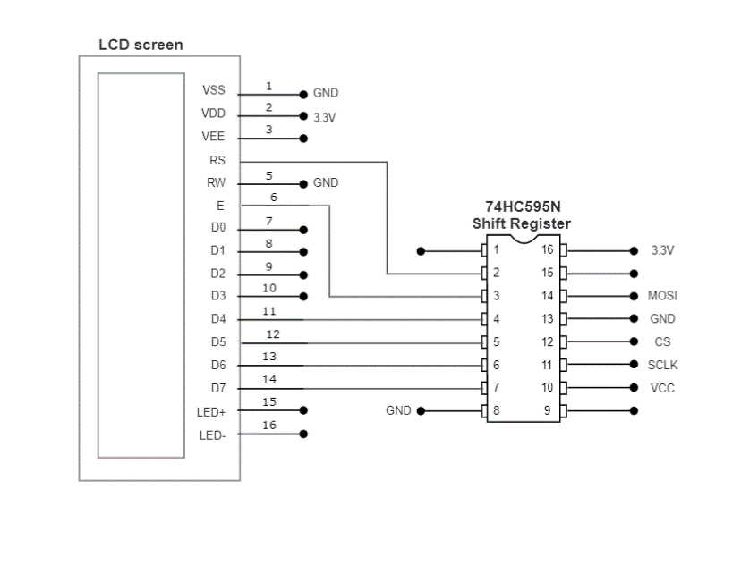
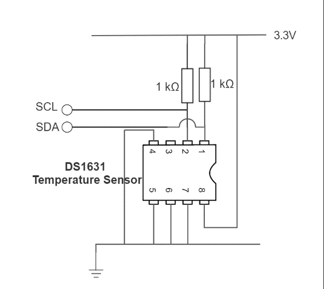

Rapid Embedded Systems - Design and Programming Course - Rev 1.0

[Table of Contents](/README.md#syllabus)

---


---

# Module 9 - Serial Communication

## Lecture Slides

The lecture slides relevant to this section are listed below. It is suggested you follow these first before attempting the lab materials.

| Lecture | Description |
| - | - |
| 9 | [Serial Communication](./Module_9.pptx) |
| |

If you clone this repository, lecture slides are available in PowerPoint format in the folder `Materials/Module_9`

# 1 Introduction

## 1.1 Lab Overview
In this lab, we will display the temperature on the LCD using serial communication. We will explore how to implement different serial communication protocols : UART, SPI and I2C using their relative interface on Mbed Studio. 


# 2 Requirements

## 2.1 Software and Hardware
In this lab, we will be using the following software and hardware: 

* SOFTWARE - one of the following:

   * **Mbed Studio**, an IDE designed to streamline development and prototyping using Mbed enabled microcontrollers and development boards: https://os.mbed.com/studio/
    
   * **Mbed online compiler**, which can be found here: https://ide.mbed.com/compiler

* **NUCLEO-F401RE**, or another suitable Mbed OS 6 compatible development board. A full list of compatible devices can be found here: https://os.mbed.com/platforms, note that outputs may have to be reconfigured for devices following a different standard.

* A breadboard, 2 x 1kΩ resistors, 1 x temperature sensor (DS1631), 1 x LCD (NHD_0216HZ) and 1 x shift register (74HC595N).

The code skeletons, which includes some support for implementing the task in [section 4.3](#43-Your-Application-Code), [section 5.2](#52-Your-Application-Code), [section 6.3](#63-Your-Application-Code) and [section 7](#70-Integration-using-high-level-API) should be found in the same folder as this manual

# 3 Hardware Setup

## 3.1 Pin Layout
In this experiment, we are going to use the Nucleo F401RE board. The pin descriptions for the board can be found below:

<figure>

<figcaption>Figure 1: The NUCLEO F401RE board pin descriptions</figcaption>
</figure>

On 2 breadboards, build the circuits in Figure 2, using the hardware components listed in 2. [“2. Requirements”](#2-Requirements):

<figure>


<figcaption>Figure 2: Circuit Layouts</figcaption>
</figure>

Connect the LEDs and the pins on the circuits to their relative pin which are defined in the table below. 

| Pin | Pin name in Mbed API |
| - | - |
| LCD SPI MOSI | D11 |
| LCD SPI MOSI | D13 |
| LCD SPI CS | D10 |
| Temperature sensor I2C SCL | D15 |
| Temperature sensor I2C SDA | D14 |
| USB UART TX | D1 |
| USB UART RX | D0 |
| - | - |


# 4	SPI

In this task we are going to display a string on an LCD screen using a shift register and the SPI API on Mbed studio

## 4.1 LCD display and Shift Register

The LCD (NHD-0216HZ-FSW-FBW-33V3C) has a 2 line x 16 character display. It can be configured, and the data can be written via SPI interface. To be able to use SPI with the LCD, you will have to use a 74HC595N shift register. 
You can find out more about shift registers and the 74HC595N in Additional references section.
You will be using the LCD in 4-bit mode. Detailed initialisation procedure can be found on page 25-26 of the ST7066U LCD driver datasheet.

## 4.2 SPI API on Mbed Studio 

The SPI Interface provides a Serial Peripheral Interface Master.
You can use this interface for communication with SPI slave devices, such as FLASH memory, LCD screens and other modules or integrated circuits.
The default settings of the SPI interface are 1MHz, 8-bit, Mode 0.
You can use the SPI interface to write data words out of the SPI port, returning the data received back from the SPI slave. You can also configure the SPI clock frequency and format which can be done using the member functions of this API :

| Function Name | Description |
| - | - |
| `SPI (PinName mosi, PinName miso, PinName sclk, PinName _unused=NC)` | Create a SPI master connected to the specified pins |
| `void format (int bits, int mode=0)` | Configure the data transmission format |
| `void frequency (int hz=1000000)` | Set the spi bus clock frequency |
| `virtual int write (int value)` | Write to the SPI Slave and return the response |
| - | - |

## 4.3 Your Application Code

The aim of this task is to print text on the LCD using the shift register and the SPI API on Mbed Studio. 
In the NHD_0216HZ.cpp, implement the function init_lcd() using the initialisation sequence from the ST7066U LCD driver datasheet.
In the main.cpp file, implement some code that will print two strings over two lines on the LCD by:
* Initialising the SPI and the LCD
* Printing the first string
* Setting the cursor to a new position
* Printing the second string

If you get stuck or need help, refer to the solution code provided for this lab or go to the troubleshooting section of the document for known issues.


# 5	UART

In this lab task, you will send text from the Nucleo F401RE Board to the PC.

## 5.1 Serial Interface on Mbed Studio

The Serial interface provides UART functionality. The serial link has two unidirectional channels, one for sending and one for receiving. The link is asynchronous, and so both ends of the serial link must be configured to use the same settings.
You can find some the member function of the Serial API in the table below:

| Function Name | Description |
| - | - |
| `Serial (PinName tx, PinName rx, const char *name=NULL)` | Create a Serial port, connected to the specified transmit and receive pins |
| `void baud (int baudrate)` | Set the baud rate of the serial port |
| `void format (int bits=8, Parity parity=SerialBase::None, int stop_bits=1)` | Set the transmission format used by the serial port |
| `int readable ()` | Determine if there is a character available to read |
| `int writeable ()` | Determine if there is space available to write a character |
| `void attach (void(*fptr)(void), IrqType type=RxIrq)` | Attach a function to call whenever a serial interrupt is generated |
| `void send_break ()` | Generate a break condition on the serial line |
| `void set_flow_control (Flow type, PinName flow1=NC, PinName flow2=NC)` | Set the flow control type on the serial port |
| `int putc(int ch, FILE *stream )` | Writes the character ch to stream. Function returns the character written, or EOF if an error happens |
| `int getc(FILE *stream )` | Read a character from the stream, an EOF indicates the end of file is reached |
| `int printf(const char *format, ... )` | Prints output both text string and data, according to format and other arguments passed to printf() |
| - | - |

## 5.2 Your application code

The aim of this task is to send “Hello to the world of mbed!” from the board to the PC with a baud rate of 9600 using the Serial interface.  
Programming the board:
* Create a Serial port
* Set the baud rate 
* Print “Hello to the world of mbed!”
  
On your PC:

* Open a terminal (There is a serial monitoring tool in Mbed Studio or you can use other tools such as Terra Term or Putty)
  * If you are running your program with Mbed Studio and you would like to use Putty or Terra, please remember to close mbed studio first after the program has been downloaded into the board
* Setup the Serial Port and the baud rate
* Connect the Nucleo F401RE Board to your PC using the USB cable (it should be already done)
* Reset your board and receive the message

# 6 I2C

In this lab task, we are going to display the temperature on the PC using the I2C interface.

## 6.1 Temperature Sensor 

In this task we are going to use the temperature sensor (DS1631), its pin configurations are presented below: 

<figure>

<figcaption>Figure 2: DS1631</figcaption>
</figure>

| Pin | Symbol | Description |
| - | - | - |
| 1	| SDA | Data Input/Output Pin for 2-Wire Serial Communication Port. Open Drain |
| 2 | SCL | Clock Input Pin for 2 Wire Serial Communication Port |
| 3 | TOUT | Thermostat Output Pin, Push and Pull |
| 4 | GND | Ground Pin |
| 5 | A1 | Address Input Pin |
| 6 | A2 | Address Input Pin |
| 7 | A3 | Address Input Pin |
| 8 | VDD | Supply Voltage Pin. +2.7V to 5.5V Power Supply Pin. |
| - | - | - |

The temperature (DS1631) can be accessed by I2C interface. 
General I2C information:
* All data is transmitted MSB first over the 2-wire bus
* One bit of data is transmitted on the 2-wire bus each SCL period
* Pull-up resistors are required on SDA and SCL lines, so that when the bus is idle both lines must remain in a logic-high state

To use it, you first need to setup the address for the temperature sensor. It is done by connecting pins 5, 6 and 7 to either Vcc or ground. In this case, we’ll connect pins 5, 6 and 7 to ground, which means that our temperature sensor address will be 1001000 0x90.
In this example, two 1kΩ pull-up resistors were used to keep the SDA and SCL lines in a logic-high while the bus is idle.
Each read or write command must start with a Control Byte:
| Bit 7 | Bit 6 | Bit 5 | Bit 4 | Bit 3 | Bit 2 | Bit 1 | Bit 0 |
| - | - | - | - | - | - | - | - |
| 1 | 0 | 0 | 1 | A<sub>2</sub> | A<sub>1</sub> | A<sub>0</sub> | R/W |
| - | - | - | - | - | - | - | - |

The R/W bit is set by the API, so you don’t need to worry about it.
Command set for DS1631:
| Command | Command in Hex | Description |
| - | - | - |
| Start Convert T | 0x51 | Initiates temperature conversions |
| Stop Convert T | 0x22 | Stops temperature conversions when the device is in continuous conversion mode |
| Read Temperature | 0xAA | Reads the last converted temperature value from the 2-byte temperature register |
| Access TH | 0xA1 | Reads or writes the 2-byte TH register |
| Access TL | 0xA2 | Reads or writes the 2-byte TL register |
| Access Config | 0xAC | Reads or writes the 1-byte configuration register |
| Software POR | 0x54 | Initiates a software power-on-reset (POR), which stops temperature conversions and resets all registers and logic to their power-up states. The software POR allows the user to simulate cycling the power without powering down the device |
| - | - | - |

The temperature register has 16 bits, divided into MSByte and LSByte, the data is aligned from MSByte to the 3 MSBs of the LSByte, as shown below:

### MSByte
| MSByte 7 | MSByte 6 | MSByte 5 | MSByte 4 | MSByte 3 | MSByte 2 | MSByte 1 | MSByte 0 |
| - | - | - | - | - | - | - | - |
| D10 | D9 | D8 | D7 | D6 | D5 | D4 | D3 |
| - | - | - | - | - | - | - | - |
### LSByte
| LSByte 7 | LSByte 6 | LSByte 5 | LSByte 4 | LSByte 3 | LSByte 2 | LSByte 1 | LSByte 0 |
| - | - | - | - | - | - | - | - |
| D2 | D1 | D0 | x | x | x | x | x |
| - | - | - | - | - | - | - | - |

The MSB is used to indicate the sign of the temperature, for example:
* If the Temp data MSByte bit D10 = 0, then the temperature is positive and Temp value (oC) = +(Temp data) x  0.125 oC.
* If the Temp data MSByte bit D10 = 1, then the temperature is negative and Temp value (oC) = o (two’s complement of Temp data) x 0.125 oC.
The detailed information can be found at the product datasheet

# 6.2 I2C Interface on Mbed Studio

You can find some the member function of the I2C API in the table below:

| Function Name | Description |
| - | - |
| `I2C (PinName sda, PinName scl)` | Create an I2C Master interface, connected to the specified pins |
| `void frequency (int hz)` | Set the frequency of the I2C interface |
| `int read (int address, char *data, int length, bool repeated=false)` | Read from an I2C slave |
| `int read (int ack)` | Read a single byte from the I2C bus |
| `int write (int address, const char *data, int length, bool repeated=false)` | Write to an I2C slave |
| `int write (int data)` | Write single byte out on the I2C bus |
| `void start (void)` | Creates a start condition on the I2C bus |
| `void stop (void)` | Creates a stop condition on the I2C bus |
| - | - |

# 6.2 Your Application Code 

The aim of this task is to display the temperature on the PC. Using the I2C Interface,
* Write the Start Convert T command to the sensor 
* Wait and Write the Read Temperature command to the sensor
* Read the 16-bit temperature data
* Convert the temperature data into real temperature, to do this refer to **DS1631 datasheet, Table 4. 12-Bit Resolution Temperature/ Data Relationship**
* Print the temperature to the PC via UART

# 7 Integration using high-level API

In this task, you are required to display the temperature on the LCD using high-level APIs, including:

| Function Name | Description |
| - | - |
| `NHD_0216HZ (PinName CS, PinName MOSI, PinName SCLK)` | Create an NHD_0216HZ LCD interface |
| `void init_lcd ()` | Initialize the NHD_0216HZ LCD |
| `void clr_lcd()` | Clear the screen |
| `void set_cursor (int column, int row)` | Set location of the starting text |
| `int printf(const char *format, ... )` | Print to the LCD |
| `DS1631 (PinName sda, PinName scl, int addr)` | Create a DS1631 temperature sensor interface |
| `int read ()` | Read the temperature register and convert to the real temperature presentation |
| - | - |


# 8 Additional references

**Documentation of the SPI API**

https://os.mbed.com/docs/mbed-os/v5.13/apis/spi.html

**Documentation of the Serial API**

https://os.mbed.com/docs/mbed-os/v5.13/apis/serial.html

**More about I2C**

https://os.mbed.com/docs/mbed-os/v5.13/apis/i2c.html

**More about shift registers**

http://en.wikipedia.org/wiki/Shift_register

**74HC595N shift register datasheet**

http://www.nxp.com/documents/data_sheet/74HC_HCT595.pdf

**ST7066U LCD driver datasheet**

http://www.newhavendisplay.com/app_notes/ST7066U.pdf 

**DS1631 temperature sensor datasheet**

http://datasheets.maximintegrated.com/en/ds/DS1631-DS1731.pdf


# 9	Troubleshooting

If you experience a problem when trying to print a word to the lcd using SPI, it could be because your init_lcd method is not correct, if you were to use the solution provided and you still can not print any word in the lcd do the following:
Make a while loop in main.cpp and inside add the init_lcd() method along with the print_lcd() , this will ensure that the lcd initializes at least one time as well as the execution of the printing function.

```C++
/*----------------------------*/
#include "mbed.h"
#include "NHD_0216HZ.h"

/*----------------------------
    MAIN FUNCTION
----------------------------*/

int main() {
    init_spi();
    while(1)
    {
        init_lcd();
        print_lcd("HELLO WORLD!");
    }
}
```
---

[Table of Contents](/README.md#syllabus)

Copyright © 2021 Arm Limited (or its affiliates). All rights reserved. 